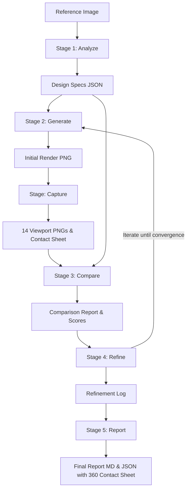

# AGENT.md — Autonomous Agent Operational Guide

> **Target Audience**: AI Coding & Reasoning Agents (e.g. Antigravity, Gemini, Claude) operating in this repository.

---

## 1. System Architecture & Core Philosophy

This repository is an **automated 2D image to 3D Blender reconstruction & closed-loop self-refining harness**. It is structured into two strictly decoupled layers:

1. **The Harness (`harness/`)**: Object-agnostic, reusable engine containing computer vision algorithms, comparison metrics, closed-loop controllers, Blender socket client, and CLI orchestration.
2. **Projects (`projects/<name>/`)**: Object-specific configurations, reference photographs, procedural Blender generation scripts, and generated artifacts.

### ⛔ Critical Agent Guardrails
- **NEVER put project-specific logic or component names in `harness/`**. Terms like `"BottleBody"`, `"BambooCap"`, or bottle dimensions MUST NOT exist in `harness/`. The harness must remain 100% object-agnostic.
- **MANDATORY POST-STAGE 1 REQUIREMENT**: In every new project, after Stage 1 analysis produces the specifications, the LLM/Agent MUST generate BOTH `scripts/generate_<name>.py` AND `scripts/refine_<name>.py` (subclassing `BaseRefinementEngine`) before running Stage 2 and Stage 4.
- **NEVER hardcode absolute paths in project scripts**. Always resolve paths relative to `os.path.dirname(__file__)` or inspect `os.environ` keys injected by the harness.
- **NEVER run long-running Blender operations without socket timeout handling**. The socket client default timeout is 60 seconds.
- **NEVER compare rendered images using raw RGB Euclidean distance**. Always use perceptual CIE $L^*a^*b^*$ and **CIEDE2000 ($\Delta E_{00}$)** from `harness.utils.color_math`.
- **NEVER alter color math implementations in individual files**. Use canonical functions from `harness.utils.color_math`.

---

## 2. Directory Ownership & Contract

| Path | Purpose | Editable by Agent? |
| :--- | :--- | :--- |
| `harness/` | Reusable core engine (analyzers, capture, comparators, refiners, pipeline orchestration) | ✅ Only when improving reusable algorithms or adding harness capabilities |
| `harness/capture/` | 14-camera spherical orbit renderer, contact sheet generator, and Blender bpy capture scripts | ✅ Only for system-wide capture improvements |
| `projects/<name>/project.yaml` | Project manifest declaring inputs, scripts, tolerances, and viewport capture settings | ✅ Always when configuring or tweaking a project |
| `projects/<name>/reference/` | Reference images (ground truth) | ⚠️ Read-only (do not overwrite original reference) |
| `projects/<name>/scripts/` | Procedural scripts (`generate_*.py`, `refine_*.py`, `verify_*.py`) | ✅ Main working area for object-specific 3D modeling & refinement |
| `projects/<name>/outputs/` | Pipeline outputs (`renders/`, `renders/viewports/`, `specs/`, `reports/`, `textures/`) | 🤖 Generated automatically by the harness |
| `mcp_server/` | Fast stdio binary MCP server and Blender addon | ✅ For MCP protocol fixes or new tools |

---

## 3. The 6-Stage Pipeline Workflow

Every 3D reconstruction follows this deterministic sequence:



### Command Reference
```bash
# Run entire pipeline
python -m harness run <project_name>

# Run individual stages
python -m harness run <project_name> --stage analyze
python -m harness run <project_name> --stage generate
python -m harness run <project_name> --stage capture   # 14-camera 360° orbit & analysis
python -m harness run <project_name> --stage compare
python -m harness run <project_name> --stage refine
python -m harness run <project_name> --stage report

# Preview execution without modifying files
python -m harness run <project_name> --dry-run
```

---

## 4. Environment Variables Contract for Project Scripts

When Stage 2 (`generate`) or Stage 4 (`refine`) invokes a project script in Blender, the harness injects the following environment variables:

| Variable | Description |
| :--- | :--- |
| `HARNESS_SPEC_DIR` | Absolute path to `projects/<project>/outputs/specs/` |
| `HARNESS_GEOM_JSON` | Absolute path to `geometry_design_doc.json` |
| `HARNESS_COLOR_JSON` | Absolute path to `color_texture_design_doc.json` |
| `HARNESS_RENDER_DIR` | Absolute path to `projects/<project>/outputs/renders/` |
| `HARNESS_VIEWPORT_DIR` | Absolute path to `projects/<project>/outputs/renders/viewports/` |
| `HARNESS_TEXTURE_DIR` | Absolute path to `projects/<project>/outputs/textures/` |

### How Project Scripts Must Read Configuration
```python
import os
import json

geom_path = os.environ.get("HARNESS_GEOM_JSON")
if not geom_path or not os.path.exists(geom_path):
    # Fallback to relative project structure
    geom_path = os.path.join(os.path.dirname(__file__), "..", "outputs", "specs", "geometry_design_doc.json")

with open(geom_path, "r", encoding="utf-8") as f:
    geom_spec = json.load(f)
```

---

## 5. How to Add a New Reconstruction Project

When a user asks you to reconstruct a new object (e.g. "Create a coffee mug from this picture"):

### Step 1: Create Project Structure
```powershell
mkdir projects/<name>/reference
mkdir projects/<name>/scripts
mkdir projects/<name>/outputs
```

### Step 2: Place Reference Image
Save the user's reference image as `projects/<name>/reference/reference.<ext>`.

### Step 3: Write `projects/<name>/project.yaml`
```yaml
name: "Ceramic Coffee Mug"
version: "1.0.0"
object_type: "mug"
reference_image: "reference/reference.jpg"
blender_scripts:
  generate: "scripts/generate_mug.py"
  refine: "scripts/refine_mug.py"
  verify: "scripts/verify_mug.py"
convergence:
  max_iterations: 6
  ciede2000_threshold: 3.5
  ssim_threshold: 0.85
  geometry_score_threshold: 0.85
render:
  resolution: [1920, 1080]
  view_transform: "Standard"
  samples: 128
viewport_capture:
  enabled: true
  resolution_scale: 0.5
  samples: 64
```

### Step 4: Run Stage 1 (Analyze)
```bash
python -m harness run <name> --stage analyze
```
This inspects the image and scene mesh, producing:
- `gemini_vision_analysis.json` (semantic breakdown, identified components, typography)
- `geometry_design_doc.json` (aspect ratios, radial mesh, component bounds)
- `structural_geometry_report.json` / `.md` (7-step structural profiling: Z-slices, symmetry, primitives, material zones, category, schema match)
- `color_texture_design_doc.json` (CIE L\*a\*b\* dominant clusters, Principled BSDF parameters, Gabor textures)
- `placement_report.json` / `placement_report.md` (6-view spatial coordinates)
- `material_manifest.json` (PolyHaven/ambientCG PBR downloaded texture maps)
- `master_3d_design_specification.json` (merged blueprint)

### Step 5: Post-Stage 1 Requirement (Project-Level Script Creation from Analyzed Specs)
> [!IMPORTANT]
> **Separation of Concerns**:
> - The base code in `harness/` is strictly general and contains **zero** hardcoded object names (no "BottleBody", "BambooCap", "handle", etc.).
> - For **every project**, after Stage 1 analysis generates the specification reports in `outputs/specs/`, the project-specific scripts **MUST be created inside the project folder** (`projects/<name>/scripts/`) derived entirely from the analyzed report:

#### Step 5a: Implement Procedural Generation Script (`projects/<name>/scripts/generate_<name>.py`)
- Reads dimensions, coordinates, and primitives from `HARNESS_GEOM_JSON` and `HARNESS_COLOR_JSON`.
- Reads resolved PBR texture maps from `material_manifest.json`.
- Constructs the 3D geometry in Blender using `bpy` and `bmesh`.
- Transmits commands via `harness.blender.client.send_blender_code`.

#### Step 5b: Implement Closed-Loop Refinement Script (`projects/<name>/scripts/refine_<name>.py`)
- Subclasses `harness.refiners.base_refiner.BaseRefinementEngine`.
- Can be generated automatically via `harness.refiners.refiner_generator.RefinerGenerator` or tailored by the LLM/Agent.
- Takes the analyzed geometry schema and detected material zones with **zero hardcoded objects**.
- Implements `apply_adjustments(pass_num: int, recommendations: List[Dict[str, Any]]) -> bool`:
  1. Inspects the `recommendations` emitted by Stage 3 (`comparison_report.json`).
  2. Maps corrective actions directly to the specific Blender objects and material nodes created in Step 5a.
  3. Formulates targeted `bpy` updates (e.g. scale mesh vertices, nudge Principled BSDF base colors).
  4. Returns `True` if adjustments were applied, or `False` if converged/no actions needed.
- Registers `refine: "scripts/refine_<name>.py"` in `project.yaml`.

### Step 6: Run Stages 2 to 5 (Full Automated Loop)
```bash
python -m harness run <name>
```
The harness will execute Stage 2 (Generate) $\to$ Stage Capture (14-camera 360° orbit & analysis) $\to$ Stage 3 (Compare) $\to$ Stage 4 (Refine using your project's `refine_<name>.py` loop until convergence) $\to$ Stage 5 (Diagnostic Report with 360° contact sheet montage).

---

## 6. How the Closed-Loop Refinement Engine Works

The refinement engine (`harness/refiners/`) implements closed-loop proportional control:

1. **Geometry Discrepancy Correction**:
   - Compares rendered silhouette against target radial profile (100 elevation slices).
   - If rendered radius at slice $i$ is smaller than target, computes $\Delta r_i = r_{target} - r_{rendered}$.
   - Sends parameter adjustments to Blender to scale mesh vertices or profile curve control points.

2. **Material & Color Correction**:
   - Samples rendered pixel colors across functional component masks.
   - Calculates **$\Delta E_{00}$ (CIEDE2000)** between rendered color and target reference color.
   - If $\Delta E_{00} > 3.0$, applies bidirectional correction:
     $$C_{new} = \text{clamp}(C_{current} + \alpha \cdot (C_{target} - C_{rendered}), 0.0, 1.0)$$
   - Updates `bpy.data.materials[...].node_tree.nodes["Principled BSDF"].inputs["Base Color"]`.

3. **Lighting & Exposure Calibration**:
   - Evaluates background wall luminance and specular highlights.
   - Dynamically adjusts key/fill light energy and camera position to eliminate shadows that distort color measurements.

---

## 7. Troubleshooting & Common Failure Modes

### Issue 1: `Could not connect to Blender at localhost:9876`
- **Cause**: Blender is not running or the add-on server is not activated.
- **Resolution**: Ensure Blender is launched and the add-on is enabled in `Edit > Preferences > Add-ons > 3D Gen: Blender MCP Connect`. If needed, run Blender headless:
  ```powershell
  blender --background --python harness/blender/addon.py
  ```

### Issue 2: Colors in Render Appear Too Bright / Washed Out
- **Cause**: Blender's color management defaults to `AgX` or `Filmic`, applying nonlinear tone-mapping.
- **Resolution**: Force view transform to `Standard`:
  ```python
  bpy.context.scene.view_settings.view_transform = 'Standard'
  bpy.context.scene.view_settings.look = 'None'
  ```

### Issue 3: Text or Details Blurry in Renders
- **Cause**: Cycles/Eevee render samples too low or camera depth-of-field active.
- **Resolution**: Disable DOF (`camera.data.dof.use_dof = False`) and set samples $\ge 128$.

### Issue 4: Windows Unicode or Stdio Encoding Errors
- **Cause**: Windows cmd/powershell standard stream default code page (cp1252).
- **Resolution**: Always set `PYTHONUTF8=1` in the process environment.
