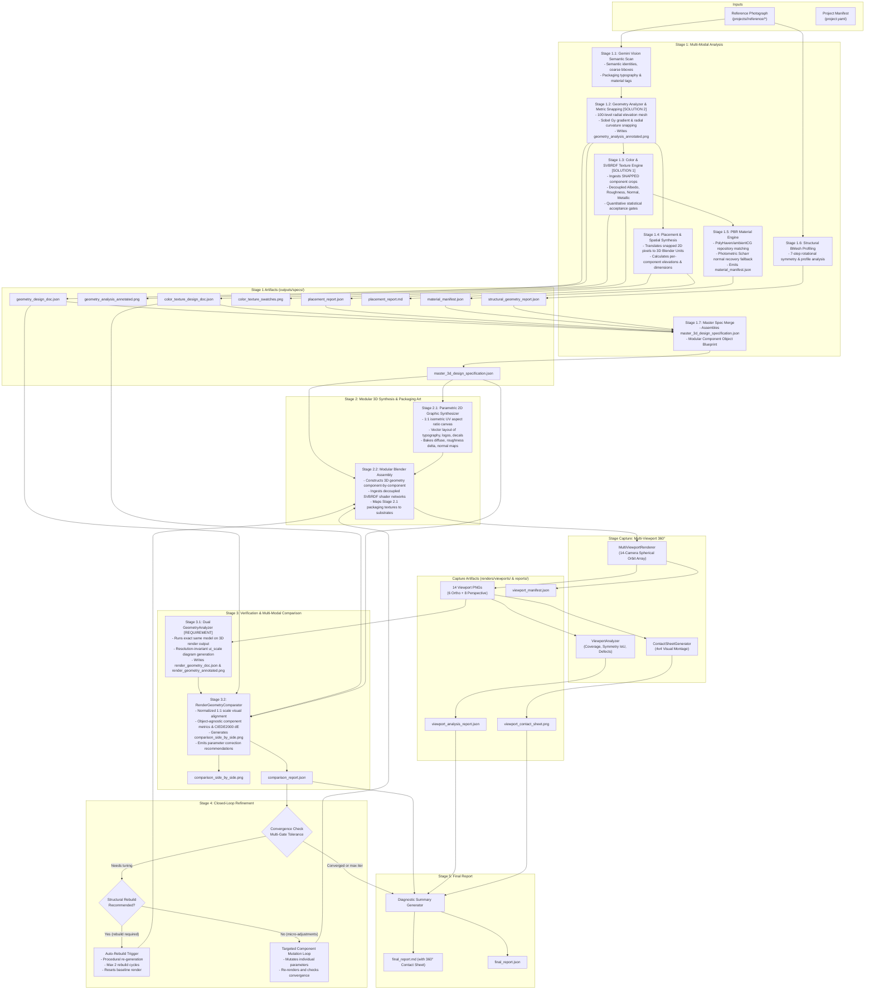

# 3D Reconstruction Pipeline Specification (v5.0.0)

This document specifies the technical architecture, mathematical foundations, data contracts, and execution model for the **Modular 2D-to-3D Reconstruction, Viewport Capture & Closed-Loop Refinement Pipeline**.

---

## 1. End-to-End Pipeline Data Flow



---

## 2. Mathematical Formulations & Algorithms

### 2.1 Perceptual Color Space Conversion: sRGB $\to$ CIE XYZ $\to$ CIE $L^*a^*b^*$

#### Step 1: Linearization of sRGB
Display sRGB values in $[0, 1]$ undergo inverse gamma correction:
$$
C_{\text{linear}} = \begin{cases}
\frac{C_{\text{sRGB}}}{12.92} & \text{if } C_{\text{sRGB}} \le 0.04045 \\
\left(\frac{C_{\text{sRGB}} + 0.055}{1.055}\right)^{2.4} & \text{if } C_{\text{sRGB}} > 0.04045
\end{cases}
$$

#### Step 2: CIE XYZ (D65 Illuminant) Transformation
Using the IEC 61966-2-1 standard matrix:
$$
\begin{bmatrix} X \\ Y \\ Z \end{bmatrix} =
\begin{bmatrix}
0.4124564 & 0.3575761 & 0.1804375 \\
0.2126729 & 0.7151522 & 0.0721750 \\
0.0193339 & 0.1191920 & 0.9503041
\end{bmatrix}
\begin{bmatrix} R_{\text{linear}} \\ G_{\text{linear}} \\ B_{\text{linear}} \end{bmatrix}
$$

#### Step 3: CIE $L^*a^*b^*$ Non-linear Mapping
With reference white point $X_n = 0.95047, Y_n = 1.00000, Z_n = 1.08883$:
$$
f(t) = \begin{cases}
t^{1/3} & \text{if } t > \epsilon \\
\frac{\kappa t + 16}{116} & \text{if } t \le \epsilon
\end{cases}
\quad \text{where } \epsilon = \frac{216}{24389} \approx 0.008856, \; \kappa = \frac{24389}{27} \approx 903.3
$$
$$
L^* = 116 \cdot f\left(\frac{Y}{Y_n}\right) - 16, \quad
a^* = 500 \cdot \left[f\left(\frac{X}{X_n}\right) - f\left(\frac{Y}{Y_n}\right)\right], \quad
b^* = 200 \cdot \left[f\left(\frac{Y}{Y_n}\right) - f\left(\frac{Z}{Z_n}\right)\right]
$$

---

### 2.2 CIEDE2000 Color Difference Metric ($\Delta E_{00}$)
The CIEDE2000 metric calculates perceived color discrepancy accounting for chroma-dependent weighting, hue rotation in blue regions, and lightness compensation:
$$
\Delta E_{00} = \sqrt{
\left(\frac{\Delta L'}{k_L S_L}\right)^2 +
\left(\frac{\Delta C'}{k_C S_C}\right)^2 +
\left(\frac{\Delta H'}{k_H S_H}\right)^2 +
R_T \left(\frac{\Delta C'}{k_C S_C}\right)\left(\frac{\Delta H'}{k_H S_H}\right)
}
$$
- $\Delta E_{00} < 1.0$: Imperceptible to the human eye.
- $1.0 \le \Delta E_{00} \le 3.0$: Perceptible on close inspection; acceptable for 3D PBR reconstruction.
- $\Delta E_{00} > 5.0$: Noticeable color mismatch requiring parameter adjustment.

---

### 2.3 100-Level Radial Profile Mesh & Geometry MAE
The object silhouette is sliced horizontally into 100 uniform elevation intervals:
$$
z_k = z_{\text{base}} + \frac{k}{99} (z_{\text{top}} - z_{\text{base}}), \quad k \in [0, 99]
$$
At each level $k$, the local cylinder radius $r_k$ is measured from the vertical symmetry axis:
$$
r_k = \frac{x_{\text{right}}(z_k) - x_{\text{left}}(z_k)}{2 \cdot r_{\text{body}}}
$$
The Mean Absolute Error (MAE) between target and rendered radial profiles is:
$$
\text{MAE}_{\text{profile}} = \frac{1}{100} \sum_{k=0}^{99} |r_k^{\text{target}} - r_k^{\text{rendered}}|
$$

---

### 2.4 Procrustes Shape Distance
Normalized 2D silhouette contours $P$ and $Q$ are aligned via optimal rigid translation, scaling, and rotation:
$$
d_{\text{Procrustes}}(P, Q) = \min_{s, R, t} \|s R P + t - Q\|_F
$$
Provides rotation- and scale-invariant validation of reconstructed silhouette geometry.

---

### 2.5 Solution 1: Neural SVBRDF Intrinsic Decomposition & Quantitative Acceptance Gates

Replaces the legacy 4-angle Gabor forced `argmax` approximation. Material recovery uses single-image SVBRDF intrinsic decomposition based on a shared feature encoder with decoupled decoders under Cook-Torrance GGX microfacet rendering formulation:
$$
f_r(\mathbf{l}, \mathbf{v}) = \frac{D(\mathbf{h}, \alpha) F(\mathbf{v}, \mathbf{h}) G(\mathbf{l}, \mathbf{v}, \alpha)}{4 (\mathbf{n} \cdot \mathbf{l}) (\mathbf{n} \cdot \mathbf{v})} + \frac{\rho_d}{\pi}
$$

#### 4-Map Decoupled Bundle
- **Albedo Map ($A \in [0, 1]^3$):** Delit diffuse color with specular glare and shadows removed.
- **Roughness Map ($R \in [0, 1]$):** Physical GGX microfacet parameter $\alpha$.
- **Tangent Normal Map ($N \in [-1, 1]^3$):** OpenGL tangent-space normal vector with $\|\mathbf{n}\| = 1$.
- **Metallic Mask ($M \in [0, 1]$):** Binary or continuous conductor segmentation mask.

#### Quantitative Acceptance Thresholds & Quality Gates
Every predicted map bundle is validated against statistical acceptance gates:

1. **Roughness Variance Gate:**
   $$\text{Var}(R) = \frac{1}{N}\sum_{i=1}^N (R_i - \bar{R})^2 \ge 0.005$$
   If $\text{Var}(R) < 0.005$, flags as degenerate uniform roughness and injects procedural micro-facet perturbation:
   $$R_{\text{final}}(x, y) = \text{clamp}\left(\bar{R} + \mathcal{N}_{\text{procedural}}(x, y) \cdot 0.08, \; 0.02, \; 0.98\right)$$

2. **Normal Map Flatness Gate:**
   $$\Phi(\mathbf{N}) = \frac{1}{N}\sum_{i=1}^N \mathbb{I}\left(\|\mathbf{N}_i - (0, 0, 1)\|_2 < 0.02\right) \le 0.98$$
   If $\Phi(\mathbf{N}) > 0.98$ (more than 98% flat $[128, 128, 255]$ normals), triggers high-pass photographic Scharr frequency gradient recovery.

3. **Albedo Specular Clipping Gate:**
   $$\Gamma(A) = \frac{1}{N}\sum_{i=1}^N \mathbb{I}\left(Y(A_i) > 0.98\right) \le 0.05$$
   If $\Gamma(A) > 0.05$, inpaints specular burn-in using a bilateral filter.

4. **Composite SVBRDF Confidence Metric ($Q_{\text{SVBRDF}} \in [0.0, 1.0]$):**
   $$Q_{\text{SVBRDF}} = 0.40 \cdot \min\left(1.0, \frac{\text{Var}(R)}{0.02}\right) + 0.40 \cdot (1.0 - \Phi(\mathbf{N})) + 0.20 \cdot (1.0 - \Gamma(A))$$
   If $Q_{\text{SVBRDF}} < 0.50$, flags as low-confidence and blends with procedural fallback node graph.

---

### 2.6 Solution 2: Metric Edge Snapping Algorithm (Coarse-to-Fine Fusion)

Replaces legacy equal-division slicing (`rel_top = idx / num_c`). Snaps Gemini semantic coarse bounding boxes to physical micro-structural boundaries:

1. **Search Window Definition:** For approximate seam $y_{\text{approx}}$, search interval:
   $$y \in [y_{\text{approx}} - \Delta y, \; y_{\text{approx}} + \Delta y] \quad (\text{default } \Delta y = 15\text{px})$$
2. **Vertical Gradient Computation:**
   $$G_y(x, y) = |\text{Sobel}_y(\text{GrayImage}, k_{\text{size}}=3)|$$
3. **Horizontal Edge Integration:**
   $$E(y) = \sum_{x = x_{\text{left}}(y)}^{x_{\text{right}}(y)} G_y(x, y)$$
4. **Metric Maximum Snapping:**
   $$y_{\text{snapped}} = \arg\max_{y \in [y_{\text{approx}} - \Delta y, \; y_{\text{approx}} + \Delta y]} E(y)$$
5. **Curvature Inflection Fallback:** If $\max(E(y)) < 1.5 \cdot \text{noise}$ (low SNR):
   - Expand window to $\pm 30\text{px}$ and apply bilateral filtering ($d=9, \sigma_c=75, \sigma_s=75$).
   - Evaluate radial profile second derivative extrema:
     $$y_{\text{snapped}} = \arg\max_{y \in [y_{\text{approx}} - 30, \; y_{\text{approx}} + 30]} \left|\frac{d^2 r}{dz^2}\right|$$
   - If still uninformative: preserve prior $y_{\text{approx}}$ and record `snapping_confidence: 0.0`.

---

### 2.7 Failure Modes & Graceful Degradation Architecture

1. **Zero Gemini Components Fallback:**
   - Silhouette extraction via Otsu / GrabCut contour bounding: $[y_{\min}, x_{\min}, y_{\max}, x_{\max}]$.
   - 100-slice radial inflection clustering ($|d^2 r / dz^2| > \tau_{\text{curvature}}$) into structural tiers.
   - CIE $L^*a^*b^*$ K-Means clustering ($K=3$) directly on segmented crops to extract actual dominant hex colors (never defaults to arbitrary `#202022`).
   - Empirical baseline roughness from luminance variance: $\alpha = \text{clamp}(1.0 - \text{Var}(I)/0.05, 0.20, 0.80)$.
2. **Edge Snapping Null Peak:** Window expansion $\pm 30\text{px} \to$ bilateral filter $\to$ curvature derivative $\to$ prior preservation ($C=0.0$).
3. **Photometric Scharr Normal Map Recovery:**
   - Compute high-pass luminance: $L_{\text{high}} = L^* - \text{GaussianBlur}(L^*, k=15)$.
   - Compute spatial gradients: $g_x = \text{Scharr}_x(L_{\text{high}}), g_y = \text{Scharr}_y(L_{\text{high}})$.
   - Synthesize normalized tangent normal:
     $$\mathbf{N} = \text{Normalize}\left(-g_x \cdot s_{\text{normal}}, \; -g_y \cdot s_{\text{normal}}, \; 1.0\right) \quad (s_{\text{normal}} = 2.5)$$
   - Encode to 8-bit OpenGL normal map: $[128 + 127 \cdot n_x, 128 + 127 \cdot n_y, 128 + 127 \cdot n_z]$.

---

### 2.8 Multi-Viewport Spherical Camera Orbit Transform
The 14-camera array orbits the model on a bounding sphere of radius $R = r_{\text{bbox}} \cdot d_{\text{cam}}$ centered at the scene's axis-aligned bounding box center $\mathbf{c} = (c_x, c_y, c_z)$.
Under Blender's coordinate system ($+X = \text{right}, -Y = \text{front}, +Y = \text{back}, +Z = \text{up}$), the camera position $\mathbf{p} = (x, y, z)$ is parameterized by azimuth $\phi \in [0, 360^\circ)$ and elevation $\alpha \in [-90^\circ, +90^\circ]$:
$$
x = c_x + R \cos\alpha \sin\phi, \quad
y = c_y - R \cos\alpha \cos\phi, \quad
z = c_z + R \sin\alpha
$$
The camera orientation quaternion $\mathbf{q} \in \mathbb{H}$ aligns the optical axis $-\mathbf{z}_{\text{cam}}$ with the target direction vector:
$$
\mathbf{d} = \frac{\mathbf{c} - \mathbf{p}}{\|\mathbf{c} - \mathbf{p}\|}
$$
To eliminate gimbal singularity when looking directly at polar vertices ($|\mathbf{d}_z| > 0.999$), the up-vector $\mathbf{u}$ switches from world-Z to world-Y:
$$
\mathbf{u} = \begin{cases}
(0, 1, 0)^T & \text{if } |\mathbf{d}_z| > 0.999 \\
(0, 0, 1)^T & \text{otherwise}
\end{cases}
$$

---

### 2.9 Cross-Viewport Silhouette & Symmetry Metrics

#### Lateral Symmetry (Left vs Right)
$$
\text{IoU}_{\text{lateral}} = \frac{\sum_{x, y} \left[ M_L(x, y) \land M_R(W - 1 - x, y) \right]}{\sum_{x, y} \left[ M_L(x, y) \lor M_R(W - 1 - x, y) \right]} \times 100\%
$$

#### Anterior-Posterior Symmetry (Front vs Back)
$$
\text{IoU}_{\text{AP}} = \frac{\sum_{x, y} \left[ M_F(x, y) \land M_B(W - 1 - x, y) \right]}{\sum_{x, y} \left[ M_F(x, y) \lor M_B(W - 1 - x, y) \right]} \times 100\%
$$

#### Vertical Footprint Ratio (Top vs Bottom)
$$
\rho_{\text{TB}} = \frac{\sum_{x, y} M_{\text{top}}(x, y)}{\max\left(1, \sum_{x, y} M_{\text{bottom}}(x, y)\right)}
$$

---

### 2.10 Parametric 2D Graphic Surface & Packaging Art Synthesizer (Stage 2.1)

#### 2.10.1 Parametric UV Canvas Aspect Ratio Formulation
For cylindrical revolution components:
$$
W_{\text{canvas}} = \text{round}(2\pi \cdot r_{\text{body}} \cdot S_{\text{res}}), \quad H_{\text{canvas}} = \text{round}(h_{\text{comp}} \cdot S_{\text{res}})
$$
$$
\text{Aspect Ratio}_{\text{cylindrical}} = \frac{W_{\text{canvas}}}{H_{\text{canvas}}} = \frac{2\pi \cdot r_{\text{body}}}{h_{\text{comp}}}
$$
For planar components:
$$
\text{Aspect Ratio}_{\text{planar}} = \frac{w_{\text{comp}}}{h_{\text{comp}}}
$$
Zero-meridian front center alignment anchors primary branding at $u_{\text{front}} = 0.50 \implies x_{\text{front}} = 0.50 \cdot W_{\text{canvas}}$.

#### 2.10.2 Multi-Channel Material Map Compositing
1. **Diffuse / Albedo Map ($C_{\text{diffuse}}$):**
   $$C_{\text{diffuse}}(u, v) = (1 - \alpha(u, v)) \cdot C_{\text{substrate}} + \alpha(u, v) \cdot C_{\text{ink}}(u, v)$$
2. **Roughness Delta Map ($R_{\text{surface}}$):**
   $$R_{\text{surface}}(u, v) = (1 - \alpha(u, v)) \cdot R_{\text{substrate}} + \alpha(u, v) \cdot R_{\text{ink}}$$
3. **Height / Embossing Map ($\Delta h$):**
   $$\mathbf{N} = \text{Normalize}\left(-\frac{\partial \Delta h}{\partial u}, -\frac{\partial \Delta h}{\partial v}, 1.0\right)$$

---

## 3. Modular Component Object Data Contract

### 3.1 Canonical Modular Component Object Schema

The stage contract between Stage 1 Analysis and Stage 2 Synthesis is strictly object-agnostic. All components are defined by parametric bounds, normalized elevation intervals, physical dimensions in Blender Units (BU), geometry primitives, and PBR material definitions:

```json
{
  "$schema": "https://json-schema.org/draft/2020-12/schema",
  "title": "ModularComponentObjectSpecification",
  "type": "object",
  "required": ["project_metadata", "components"],
  "properties": {
    "project_metadata": {
      "type": "object",
      "required": ["subject_name", "total_height_px", "body_diameter_px", "aspect_ratio"],
      "properties": {
        "subject_name": { "type": "string" },
        "total_height_px": { "type": "integer", "minimum": 1 },
        "body_diameter_px": { "type": "integer", "minimum": 1 },
        "aspect_ratio": { "type": "number", "minimum": 0.01 }
      }
    },
    "components": {
      "type": "object",
      "additionalProperties": {
        "type": "object",
        "required": [
          "display_name",
          "category",
          "semantic_role",
          "elevation_z_range",
          "snapped_pixel_y_bounds",
          "dimensions_bu",
          "geometry_primitive",
          "pbr_material"
        ],
        "properties": {
          "display_name": { "type": "string" },
          "category": {
            "type": "string",
            "enum": ["enclosure", "closure", "collar", "substrate", "structural_base", "attachment", "decal_layer"]
          },
          "semantic_role": { "type": "string" },
          "elevation_z_range": {
            "type": "array",
            "items": { "type": "number", "minimum": 0.0, "maximum": 1.0 },
            "minItems": 2,
            "maxItems": 2
          },
          "snapped_pixel_y_bounds": {
            "type": "array",
            "items": { "type": "integer", "minimum": 0 },
            "minItems": 2,
            "maxItems": 2
          },
          "snapping_confidence": { "type": "number", "minimum": 0.0, "maximum": 1.0 },
          "dimensions_bu": {
            "type": "object",
            "required": ["width", "depth", "height"],
            "properties": {
              "width": { "type": "number", "minimum": 0.001 },
              "depth": { "type": "number", "minimum": 0.001 },
              "height": { "type": "number", "minimum": 0.001 }
            }
          },
          "geometry_primitive": {
            "type": "string",
            "enum": ["cylinder", "lathe_profile", "box", "revolved_contour", "concave_lathe", "torus", "bmesh_custom"]
          },
          "pbr_material": {
            "type": "object",
            "required": ["material_id", "base_color_hex", "metallic", "roughness"],
            "properties": {
              "material_id": { "type": "string" },
              "base_color_hex": { "type": "string", "pattern": "^#[0-9A-Fa-f]{6}$" },
              "metallic": { "type": "number", "minimum": 0.0, "maximum": 1.0 },
              "roughness": { "type": "number", "minimum": 0.0, "maximum": 1.0 },
              "texture_maps": {
                "type": "object",
                "properties": {
                  "diffuse": { "type": "string" },
                  "roughness": { "type": "string" },
                  "normal": { "type": "string" },
                  "metallic": { "type": "string" }
                }
              }
            }
          }
        }
      }
    }
  }
}
```

---

## 4. Stage 3 Verification & Multi-Modal Comparison Specification

Stage 3 executes rigorous, objective verification between the reconstructed 3D render outputs and the reference specifications established in Stage 1.

### 4.1 Requirement 1: Unified Dual-Analysis Architecture (Identical Model)

To guarantee mathematical consistency and eliminate subjective discrepancy, **the rendered 3D scene image MUST be processed by the exact same `GeometryAnalyzer` pipeline and underlying feature extraction models as the reference photograph**:

1. **Symmetrical Feature Extraction**:
   - **Continuous Foreground Segmentation**: Background removal using floor-contact gradient boundary detection ($G_y$ cut-off thresholding) to strictly eliminate cast shadow contamination while preserving dark structural bases.
   - **Contour Polynomials**: Identical polynomial curve fitting ($N=6$) on both left and right silhouette edges.
   - **100-Level Radial Profile Mesh**: Uniform elevation slicing from base ($z=0.0$) to apex ($z=1.0$), calculating radius ratio to maximum diameter:
     $$r_k = \frac{x_{\text{right}}(z_k) - x_{\text{left}}(z_k)}{2 \cdot r_{\text{body}}}, \quad k \in [0, 99]$$
   - **Bayesian MAP Seam Edge Snapping**: Identical Gaussian prior ($\sigma = 3.5\text{ px}$, search window $\pm 10\text{ px}$) and Sobel vertical gradient integration:
     $$y_{\text{snapped}} = \arg\max_{y \in [y_{\text{approx}} - 10, \; y_{\text{approx}} + 10]} \left[ E(y) \cdot \exp\left(-\frac{(y - y_{\text{approx}})^2}{2\sigma^2}\right) \right]$$
   - **Modular Component Decomposition**: Direct extraction of the 3-tier component object model (`comp_upper_structure`, `comp_main_body`, `comp_base_section` or project-specific modular components).
2. **Standardized Output Artifacts**:
   - `render_geometry_doc.json`: Conforms to the exact same JSON schema as `geometry_design_doc.json`.
   - `render_geometry_annotated.png`: Generated using the identical annotation layout engine as `geometry_analysis_annotated.png`.
3. **Strict Prohibition**: Ad-hoc bounding boxes, hardcoded pixel offsets, or bypassing `GeometryAnalyzer` on rendered output images is strictly prohibited.

---

### 4.2 Requirement 2: Resolution-Invariant Annotation Diagram Generator

All annotated visual artifacts (`geometry_analysis_annotated.png` and `render_geometry_annotated.png`) must dynamically adapt to varying camera resolutions and aspect ratios using dynamic UI scaling:

1. **Dynamic UI Scale Factor**:
   $$\text{ui\_scale} = \max\left(0.8, \; \frac{H_{\text{object\_px}}}{270.0}\right)$$
2. **Proportional Canvas Margins**:
   - Left Margin: $\text{pad}_{\text{left}} = \text{round}(60 \cdot \text{ui\_scale})$
   - Right Annotation Panel: $\text{pad}_{\text{right}} = \text{round}(280 \cdot \text{ui\_scale})$
   - Top Dimension Banner: $\text{pad}_{\text{top}} = \text{round}(65 \cdot \text{ui\_scale})$
   - Bottom Inspection Footer: $\text{pad}_{\text{bottom}} = \text{round}(50 \cdot \text{ui\_scale})$
3. **Proportional Vector & Typographic Scaling**:
   - Top banner font size: $0.52 \cdot \text{ui\_scale}$, subtitle: $0.40 \cdot \text{ui\_scale}$.
   - Card title: $0.40 \cdot \text{ui\_scale}$, category: $0.34 \cdot \text{ui\_scale}$, metrics: $0.32 \cdot \text{ui\_scale}$, swatch label: $0.30 \cdot \text{ui\_scale}$.
   - Bounding box & seam lines: thickness $\max(1, \text{round}(2 \cdot \text{ui\_scale}))$.
   - Radial sample points: radius $\max(2, \text{round}(2.5 \cdot \text{ui\_scale}))$.
   - Minimum vertical card spacing: $\Delta y_{\text{card}} = \text{round}(55 \cdot \text{ui\_scale})$.
   - Color swatch box: $\text{size} = \text{round}(10 \cdot \text{ui\_scale})$.
4. **Zero-Cropping Guarantee**:
   All labels, brackets, leader lines, color swatches, and metric readouts must reside entirely within the padded canvas margins. Truncation or clipping by canvas borders is an automatic pipeline validation failure.

---

### 4.3 Requirement 3: Normalized 1:1 Scale Side-by-Side Diagnostic Comparison

Direct visual comparison between raw images of disparate resolutions (e.g. $192 \times 341$ reference vs. $720 \times 1280$ render) distorts visual perception and introduces false perceived height errors. Therefore, `RenderGeometryComparator.generate_side_by_side_comparison` must enforce **Normalized 1:1 Scale Baseline Alignment**:

1. **Normalized Target Display Height**:
   Both panels are scaled such that the detected physical object occupies an identical vertical height $H_{\text{target\_display}} = 720\text{ px}$:
   $$s_{\text{ref}} = \frac{H_{\text{target\_display}}}{H_{\text{ref\_object}}}, \quad s_{\text{rend}} = \frac{H_{\text{target\_display}}}{H_{\text{rend\_object}}}$$
2. **Aligned Baselines & Proportional Margins**:
   - Both panels are aligned to a shared object apex vertical coordinate ($y_{\text{apex}} = y_{\text{header}} + \text{margin}_{\text{top}}$).
   - Horizontal Guide Lines across the divider:
     - **Top Apex**: $\Delta Y = |y_{\text{left}} - y_{\text{right}}| \equiv 0\text{ px}$ (horizontal magenta guide line).
     - **Table Contact Base**: $\Delta Y = |y_{\text{left}} - y_{\text{right}}| \equiv 0\text{ px}$ (horizontal bright green guide line).
3. **Physical Seam Tracking Across Divider**:
   - For every corresponding component boundary $c_i$, a connecting guide line spans the central divider between the reference seam and the render seam.
   - The vertical delta $\text{dY} = |y_{\text{left}} - y_{\text{right}}|$ is dynamically annotated on the divider with status indicators:
     - $\text{dY} \le 8\text{ px}$: Green (High Fidelity)
     - $8\text{ px} < \text{dY} \le 20\text{ px}$: Orange (Moderate Drift)
     - $\text{dY} > 20\text{ px}$: Red (Significant Discrepancy)

---

### 4.4 Requirement 4: Object-Agnostic Modular Component Verification & Recommendations

Stage 3 performs automated quantitative evaluation across all modular components defined in `geometry_design_doc.json`:

1. **Component Height Span Ratio**:
   $$e_{h, i} = \frac{|h_{\text{ratio}, i}^{\text{rendered}} - h_{\text{ratio}, i}^{\text{target}}|}{h_{\text{ratio}, i}^{\text{target}}}$$
   Fidelity score: $\text{Fidelity}_{h, i} = \max\left(0, \; 100 \cdot (1.0 - e_{h, i})\right)$. If $e_{h, i} > 0.15$ ($15\%$ error), triggers an automated correction recommendation.
2. **Aspect Ratio Fidelity**:
   $$e_{\text{AR}} = \frac{|\text{AR}_{\text{rendered}} - \text{AR}_{\text{target}}|}{\text{AR}_{\text{target}}}$$
   Fidelity score: $\text{Fidelity}_{\text{AR}} = \max\left(0, \; 100 \cdot (1.0 - e_{\text{AR}})\right)$. If $e_{\text{AR}} > 0.025$, emits a body scale XY adjustment recommendation.
3. **Radial Profile Mesh MAE**:
   $$\text{MAE}_{\text{profile}} = \frac{1}{100} \sum_{k=0}^{99} |r_k^{\text{target}} - r_k^{\text{rendered}}|$$
   Identifies worst deviation level $z_{\text{worst}}$ and computes Procrustes shape distance $d_{\text{Procrustes}}$.
4. **Perceptual Color Discrepancy ($\Delta E_{00}$)**:
   Computes CIEDE2000 color difference between reference component color hex and rendered component color hex. If $\Delta E_{00} > 6.0$, emits a material color tuning directive.
5. **Multi-Modal Fidelity Score Formulation**:
   $$\text{Fidelity}_{\text{total}} = 0.50 \cdot \overline{\text{Fidelity}}_{\text{geom}} + 0.35 \cdot \overline{\text{Fidelity}}_{\text{color}} + 0.15 \cdot \text{Fidelity}_{\text{texture}}$$
6. **Actionable Correction Directives**:
   Outputs a structured list of actionable recommendations in `comparison_report.json` specifying parameter names, target deltas, and execution priorities (`HIGH` / `MEDIUM`), directly consumed by Stage 4 Refinement.

---

### 4.5 Requirement 5: Structural Recommendation Tagging & Rebuild Directives

`RenderGeometryComparator` mathematically discriminates between micro parameter adjustments (e.g. slight vertex nudges, shader tweaks) and severe structural/topological discrepancies:

1. **Structural Classification Criteria**:
   A corrective action is designated as structural (`is_structural: True`, `requires_rebuild: True`, priority `HIGH`) when:
   - **Aspect Ratio Drift**: $e_{\text{AR}} > 0.030$ ($> 3\%$ error) or body scale target delta $| \Delta_{\text{scale}} | > 0.035$.
   - **Component Height Proportions**: Relative height error $e_{h, i} > 0.080$ ($> 8\%$) or absolute ratio discrepancy $|h_{\text{ratio}, i}^{\text{rendered}} - h_{\text{ratio}, i}^{\text{target}}| > 0.015$.
   - **Radial Profile Contour**: Radial profile MAE exceeds tolerance threshold ($\text{MAE}_{\text{profile}} > 0.040$).
2. **Convergence Status Contract**:
   `convergence_status` explicitly reports:
   ```json
   {
     "converged": bool,
     "aspect_ratio_ok": bool,
     "components_proportioned": bool,
     "colors_calibrated": bool,
     "contour_profile_ok": bool,
     "structural_rebuild_recommended": bool,
     "component_height_ratio_errors": { ... }
   }
   ```
   If `structural_rebuild_recommended` is `True`, the refinement controller is directed to bypass vertex-nudging and escalate directly to procedural re-generation.

---

## 5. Closed-Loop Refinement Control Strategy

Stage 4 operates as a decoupled closed-loop feedback correction system:

### 5.1 Modular Component Isolation & Targeted Mutation
Unlike legacy whole-mesh scripting that re-synthesized the entire model from scratch, the Modular Component Object Architecture enables **Targeted Mutation**:
1. When Stage 3 comparison flags a geometry or color defect on component $c_i$, only component $c_i$'s dimensions or shader node inputs are adjusted.
2. Unaffected sibling components retain their geometry, preventing cascading drift across neighboring seams.

### 5.2 Proportional Error Correction Formulation
1. **State Vector**:
   $$x_k = \begin{bmatrix} s_1 & s_2 & \dots & C_1 & C_2 & \dots & R_1 & \dots \end{bmatrix}^T$$
   where $s_i$ are component scales/dimensions, $C_i$ are Principled BSDF base colors, and $R_i$ are roughness parameters.
2. **Error Vector**:
   $$e_k = y_{\text{target}} - y_k$$
   where $y_k$ contains measured aspect ratios, radial deviations, and $\Delta E_{00}$ color deltas per component.
3. **Control Update Law**:
   $$x_{k+1} = x_k + K_p \cdot e_k$$
   with gain matrix $K_p \in [0.15, 0.40]$ to guarantee asymptotic stability without oscillation.

### 5.3 Automated Escalation: Auto-Rebuild on Structural Recommendations
When structural discrepancies are detected, vertex translation loops deform mesh topology and distort UV unwrapping. `BaseRefinementEngine` therefore executes an automated **Auto-Rebuild Escalation**:

1. **Rebuild Inspection (`check_structural_rebuild_needed`)**:
   - Inspects recommendations for `requires_rebuild: True` or `is_structural: True`.
   - Checks if component vertical span error exceeds $0.015$ or scale delta exceeds $0.035$.
2. **Procedural Re-Generation Trigger (`trigger_rebuild`)**:
   - Dispatches the project's procedural generation script (`generate_<name>.py`) via the active Blender socket connection (port 9876) or host client runner.
   - Cleans previous mesh instances while preserving camera and lighting configurations.
   - Enforces a safety quota ($\text{max\_rebuilds} = 2$) to guarantee termination and prevent infinite rebuild oscillations.
3. **Baseline Reset**:
   - Re-renders the freshly generated scene (`refine_pass_{pass}_rebuild.png`).
   - Runs `evaluate_render()` to establish a clean post-rebuild metric baseline before continuing with parameter micro-adjustments.
4. **Design Spec Dynamic Ingestion**:
   - Before rebuild execution, `refine_<name>.py` synchronizes structural target dimensions back into `geometry_design_doc.json`.
   - `generate_<name>.py` dynamically ingests updated dimension constants from `geometry_design_doc.json` for fully parametric re-construction.

### 5.4 Packaging Substrate Tinting Architecture (`LabelTint`)
When high-resolution bitmap/vector packaging artwork is mapped onto 3D substrates:
1. **The Texture Blockage Problem**:
   Connecting an image texture output directly to Principled BSDF `Base Color` overrides socket color values, preventing real-time closed-loop diffuse color correction during refinement.
2. **Shader Solution**:
   A `ShaderNodeMix` node named `LabelTint` (data type: `RGBA`, blend type: `MULTIPLY`, `Factor = 1.0`) is placed between the diffuse texture and the BSDF:
   $$\text{FinalColor} = \text{DiffuseTexture} \times \text{LabelTint}$$
3. **Strict Color Linearization**:
   All incoming sRGB hex/RGB targets are converted to linear space via $sRGB \to \text{linear}$ prior to shader assignment, guaranteeing photometric consistency with Cycles standard color management.

### 5.5 Strict Multi-Gate Component-Level Convergence Validation
Refinement does not terminate on a simple overall score heuristic. Convergence strictly mandates satisfying **all four component tolerance gates simultaneously**:
1. **Aspect Ratio Gate**:
   $$e_{\text{AR}} \le 0.020 \quad (2.0\% \text{ tolerance})$$
2. **Component Proportions Gate**:
   $$\forall c_i: \quad |h_{\text{ratio}, i}^{\text{rendered}} - h_{\text{ratio}, i}^{\text{target}}| \le 0.008 \quad (0.8\% \text{ tolerance})$$
3. **Perceptual Color Calibration Gate**:
   $$\forall c_i: \quad \Delta E_{00}(c_i) \le 6.5 \quad (\text{with overall mean } \overline{\Delta E}_{00} \le 4.5)$$
4. **Silhouette Contour Gate**:
   $$\text{MAE}_{\text{profile}} \le 0.040$$
5. **Overall Multi-Modal Fidelity**:
   $$\text{Fidelity}_{\text{total}} \ge 92.0\%$$
