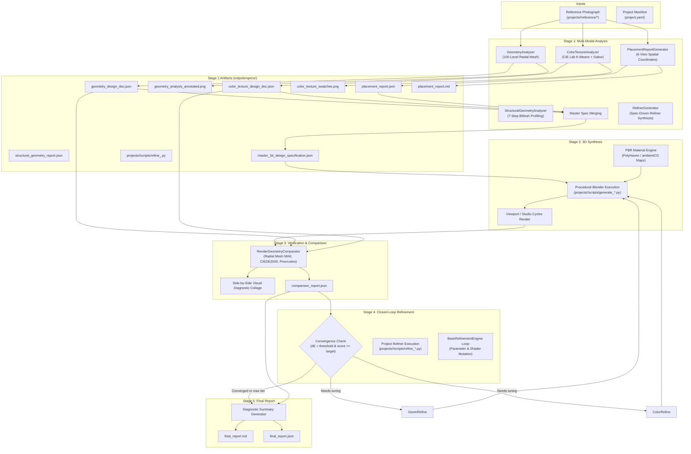

# 3D Reconstruction Pipeline Specification (v4.0.0)

This document specifies the technical architecture, mathematical foundations, data contracts, and execution model for the **5-Stage 2D-to-3D Reconstruction & Refinement Pipeline**.

---

## 1. End-to-End Pipeline Data Flow



---

## 2. Mathematical Formulations & Algorithms

### 2.1 Perceptual Color Space Conversion: sRGB $\to$ CIE XYZ $\to$ CIE $L^*a^*b^*$

#### Step 1: Linearization of sRGB
Display sRGB values in $[0, 1]$ undergo inverse gamma correction:
$$
C_{\text{linear}} = \begin{cases}
\frac{C_{\text{sRGB}}}{12.92} & \text{if } C_{\text{sRGB}} \le 0.04045 \\
\left(\frac{C_{\text{sRGB}} + 0.055}{1.055}\right)^{2.4} & \text{if } C_{\text{sRGB}} > 0.04045
\end{cases}
$$

#### Step 2: CIE XYZ (D65 Illuminant) Transformation
Using the IEC 61966-2-1 standard matrix:
$$
\begin{bmatrix} X \\ Y \\ Z \end{bmatrix} =
\begin{bmatrix}
0.4124564 & 0.3575761 & 0.1804375 \\
0.2126729 & 0.7151522 & 0.0721750 \\
0.0193339 & 0.1191920 & 0.9503041
\end{bmatrix}
\begin{bmatrix} R_{\text{linear}} \\ G_{\text{linear}} \\ B_{\text{linear}} \end{bmatrix}
$$

#### Step 3: CIE $L^*a^*b^*$ Non-linear Mapping
With reference white point $X_n = 0.95047, Y_n = 1.00000, Z_n = 1.08883$:
$$
f(t) = \begin{cases}
t^{1/3} & \text{if } t > \epsilon \\
\frac{\kappa t + 16}{116} & \text{if } t \le \epsilon
\end{cases}
\quad \text{where } \epsilon = \frac{216}{24389} \approx 0.008856, \; \kappa = \frac{24389}{27} \approx 903.3
$$
$$
L^* = 116 \cdot f\left(\frac{Y}{Y_n}\right) - 16, \quad
a^* = 500 \cdot \left[f\left(\frac{X}{X_n}\right) - f\left(\frac{Y}{Y_n}\right)\right], \quad
b^* = 200 \cdot \left[f\left(\frac{Y}{Y_n}\right) - f\left(\frac{Z}{Z_n}\right)\right]
$$

### 2.2 CIEDE2000 Color Difference Metric ($\Delta E_{00}$)
The CIEDE2000 metric calculates perceived color discrepancy accounting for chroma-dependent weighting, hue rotation in blue regions, and lightness compensation:
$$
\Delta E_{00} = \sqrt{
\left(\frac{\Delta L'}{k_L S_L}\right)^2 +
\left(\frac{\Delta C'}{k_C S_C}\right)^2 +
\left(\frac{\Delta H'}{k_H S_H}\right)^2 +
R_T \left(\frac{\Delta C'}{k_C S_C}\right)\left(\frac{\Delta H'}{k_H S_H}\right)
}
$$
- $\Delta E_{00} < 1.0$: Imperceptible to the human eye.
- $1.0 \le \Delta E_{00} \le 3.0$: Perceptible on close inspection; acceptable for 3D PBR reconstruction.
- $\Delta E_{00} > 5.0$: Noticeable color mismatch requiring parameter adjustment.

### 2.3 100-Level Radial Profile Mesh & Geometry MAE
The object silhouette is sliced horizontally into 100 uniform elevation intervals:
$$
z_k = z_{\text{base}} + \frac{k}{99} (z_{\text{top}} - z_{\text{base}}), \quad k \in [0, 99]
$$
At each level $k$, the local cylinder radius $r_k$ is measured from the vertical symmetry axis:
$$
r_k = \frac{x_{\text{right}}(z_k) - x_{\text{left}}(z_k)}{2 \cdot r_{\text{body}}}
$$
The Mean Absolute Error (MAE) between target and rendered radial profiles is:
$$
\text{MAE}_{\text{profile}} = \frac{1}{100} \sum_{k=0}^{99} |r_k^{\text{target}} - r_k^{\text{rendered}}|
$$

### 2.4 Procrustes Shape Distance
Normalized 2D silhouette contours $P$ and $Q$ are aligned via optimal rigid translation, scaling, and rotation:
$$
d_{\text{Procrustes}}(P, Q) = \min_{s, R, t} \|s R P + t - Q\|_F
$$
Provides rotation- and scale-invariant validation of reconstructed silhouette geometry.

### 2.5 Multi-Scale Gabor Filter Bank for Texture Anisotropy
To detect wood grain, brushed metal striations, and surface textures, an 8-orientation Gabor filter bank is evaluated:
$$
g(x, y; \lambda, \theta, \psi, \sigma, \gamma) = \exp\left(-\frac{x'^2 + \gamma^2 y'^2}{2\sigma^2}\right) \cos\left(2\pi \frac{x'}{\lambda} + \psi\right)
$$
where $x' = x \cos\theta + y \sin\theta$ and $y' = -x \sin\theta + y \cos\theta$.
The dominant grain angle is computed as:
$$
\theta_{\text{grain}} = \arg\max_\theta \sum_{x, y} |I(x, y) * g(x, y; \lambda, \theta)|
$$
Anisotropy ratio:
$$
\rho_{\text{anisotropy}} = \frac{\max_\theta E(\theta)}{\text{median}_\theta E(\theta)}
$$

---

## 3. Intermediate Artifact JSON Schemas

### 3.1 `geometry_design_doc.json`
```json
{
  "image_path": "projects/bottle/reference/reference_bottle.jpg",
  "overall_dimensions": {
    "bbox_pixels": [x_min, y_min, width_px, height_px],
    "aspect_ratio_height_to_width": 4.04,
    "center_x_px": 512.0
  },
  "radial_profile_mesh_100_levels": [
    {
      "level_index": 0,
      "elevation_ratio": 0.0,
      "radius_ratio_to_body": 0.995,
      "left_x_px": 380,
      "right_x_px": 644,
      "diameter_px": 264
    }
  ],
  "components": {
    "base_section": { "pixel_y_seam": 870, "pixel_y_bottom": 945, "height_ratio": 0.078 },
    "body_shoulder": { "pixel_y_top": 280, "pixel_y_bottom": 385, "height_ratio": 0.110 },
    "bamboo_cap": { "pixel_y_top": 190, "pixel_y_bottom": 280, "radius_ratio_to_body": 0.612 },
    "handle_loop": { "pixel_y_top": 120, "pixel_y_bottom": 190, "height_ratio": 0.073 }
  }
}
```

### 3.2 `color_texture_design_doc.json`
```json
{
  "dominant_palette_cielab_kmeans": [
    {
      "cluster_rank": 1,
      "pixel_percentage": 64.2,
      "srgb_hex": "#131315",
      "srgb_normalized": [0.075, 0.075, 0.082],
      "cielab": [7.8, 0.2, -1.1]
    }
  ],
  "component_materials": {
    "matte_bottle_body": {
      "principled_bsdf": {
        "base_color_rgba": [0.075, 0.075, 0.082, 1.0],
        "roughness": 0.72,
        "metallic": 0.0,
        "specular_ior_level": 0.5
      },
      "texture_analysis": {
        "dominant_grain_angle_deg": 0.0,
        "anisotropy_ratio": 1.05,
        "surface_finish": "Matte Powder-Coat"
      }
    }
  }
}
```

### 3.3 `comparison_report.json`
```json
{
  "overall_score": 77.7,
  "comparison": {
    "overall_fidelity": {
      "total_score_pct": 77.7,
      "geometry_score_pct": 78.4,
      "color_score_pct": 76.5
    },
    "metrics": [
      {
        "metric": "Aspect Ratio (H/W)",
        "target": "4.04",
        "rendered": "4.12",
        "fidelity_pct": 98.0
      },
      {
        "metric": "Body Color (CIEDE2000)",
        "target": "dE < 3.0",
        "rendered": "dE = 2.4",
        "fidelity_pct": 92.0
      }
    ],
    "correction_recommendations": [
      {
        "priority": "HIGH",
        "parameter": "Cap Diameter",
        "action": "Scale cap radius by 0.96x"
      }
    ]
  }
}
```

---

## 4. Closed-Loop Refinement Control Strategy

Stage 4 operates as a decoupled closed-loop feedback correction system:

### 4.1 Architecture & Separation of Concerns
1. **Generic Controller (`harness/refiners/base_refiner.py`)**:
   - `BaseRefinementEngine`: Object-agnostic abstract orchestrator.
   - Manages pass loops, convergence checks against thresholds ($\Delta E_{00}$, geometry score), render triggers, and comparator invocation.
   - Saves structured iteration logs (`refinement_log.json`).

2. **Project-Generated Refiner (`projects/<name>/scripts/refine_<name>.py`)**:
   - Generated by the AI Agent / LLM immediately following Stage 1 analysis based on `harness/refiners/template_refiner.py`.
   - Subclasses `BaseRefinementEngine` and implements `apply_adjustments(pass_num, recommendations)`.
   - Translates Stage 3 recommendations (`comparison_report.json`) into targeted `bpy` operations for the specific object's mesh vertices, scales, and Principled BSDF node inputs.

### 4.2 Proportional Error Correction Formulation
1. **State Vector**:
   $$x_k = \begin{bmatrix} s_1 & s_2 & \dots & C_1 & C_2 & \dots & R_1 & \dots \end{bmatrix}^T$$
   where $s_i$ are component scales/dimensions, $C_i$ are Principled BSDF base colors, and $R_i$ are roughness parameters.
2. **Error Vector**:
   $$e_k = y_{\text{target}} - y_k$$
   where $y_k$ contains measured aspect ratios, radial deviations, and $\Delta E_{00}$ color deltas.
3. **Control Update Law**:
   $$x_{k+1} = x_k + K_p \cdot e_k$$
   with gain matrix $K_p \in [0.15, 0.40]$ to guarantee asymptotic stability without oscillation.
4. **Termination Criteria**:
   $$\|e_k\|_{\infty} < \tau_{\text{tol}} \quad \lor \quad k \ge k_{\text{max}}$$
