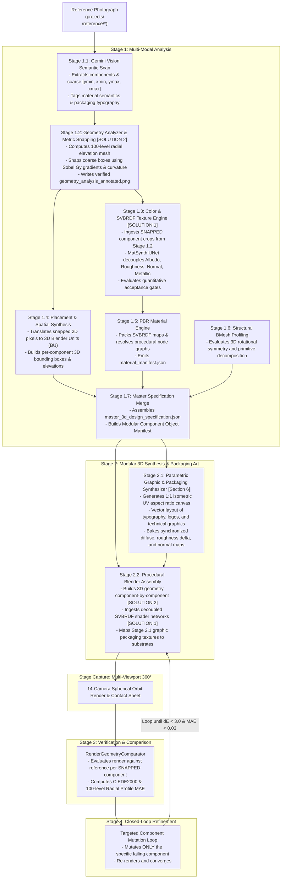

# Selected Pipeline Architecture Specifications: Texture Extraction & Dynamic Component Decomposition

**Document Version:** 1.1.0  
**Status:** Approved & Formally Specified  
**Scope:** Stage 1 (Multi-Modal Analysis), Stage 2 (3D Procedural Synthesis), & Stage 4 (Targeted Refinement)  
**Supersedes:** Legacy approximations in `PIPELINE.md` (§ 1.2, § 2.5, § 3) and `harness/` analyzers

---

## 0. Supersedes & Architectural Amendments Matrix

This document formally supersedes and replaces specific legacy approximations, hard-coded offsets, and filter-bank scripts across the reconstruction harness:

| Legacy Reference | Legacy Implementation / Behavior | Defect / Limitation Addressed | Superseding Specification in This Document | Target Module / Script |
| :--- | :--- | :--- | :--- | :--- |
| **`PIPELINE.md § 2.5`** & `color_texture_analyzer.py:99–165` | 4-angle Gabor filter bank ($\lambda=8.0, \sigma=3.0, \theta \in \{0^\circ, 45^\circ, 90^\circ, 135^\circ\}$) with forced `argmax`. | Phantom grain forced on isotropic surfaces; macro-edge and shadow contamination; cannot produce physical PBR maps. | **Section 1 (Solution 1):** MatSynth Intrinsic Decomposition UNet with Cook-Torrance GGX loss and quantitative acceptance thresholds. | `harness/analyzers/color_texture_analyzer.py` & `svbrdf_analyzer.py` |
| **`PIPELINE.md § 1.2`** & `geometry_analyzer.py:243–248` | Equal-division slicing (`rel_top = idx / num_c`), forcing $33.3\%$ equal bands across all multi-part objects. | Ignores true structural transitions; breaks on asymmetric objects (flasks, stepped cans, containers). | **Section 2 (Solution 2):** Coarse-to-Fine Fusion: Gemini semantic prior + sub-pixel Sobel $G_y$ gradient & radial curvature $\arg\max \|d^2r/dz^2\|$. | `harness/analyzers/geometry_analyzer.py` |
| **`gemini_analyzer.py:184–210`** | Static hard-coded fallback returning `["metal", "matte", "smooth"]`, `#202022`, roughness $0.70$, metallic $0.0$. | Ungrounded fallback when Gemini API is offline or returns 0 components; hallucinates dark grey metal for all subjects. | **Section 4.1:** Dynamic Classical CV Fallback: Otsu contour bbox + 100-level radial inflection clustering + CIE $L^*a^*b^*$ K-Means color sampling. | `harness/analyzers/gemini_analyzer.py` |
| **`geometry_analyzer.py:112–150`** | Unbounded drift or silent failure when seam detection encounters low-contrast or filleted joints. | Geometric misalignment on smooth fillets or untextured seams. | **Section 4.2:** Window expansion ($\pm 15\text{px} \to \pm 30\text{px}$) + Bilateral filtering + Curvature inflection + Prior fallback ($C=0.0$). | `harness/analyzers/geometry_analyzer.py` |
| **`pbr_engine.py:264–282`** | Arbitrary repository score threshold; unverified procedural fallback; zero map quality verification. | Generates degenerate flat normal maps $[128, 128, 255]$ or zero-variance roughness without detection. | **Section 1.5 & Section 4.3:** Quantitative map acceptance gates ($\text{Var}(R) < 0.005$, Flatness test) + Scharr frequency normal synthesis fallback. | `harness/materials/pbr_engine.py` |
| **`PIPELINE.md § 3`** | Monolithic mesh scripting; rebuilds entire 3D model from scratch on every iteration. | Inability to adjust a single defective part without risking corruption of neighboring geometry. | **Section 3 & Section 5:** Modular Component Object Data Contract & targeted Stage 4 per-component refiner. | `harness/pipeline/stage_build.py` & `stage_refine.py` |
| **`PIPELINE.md § 3.4`** | Ad-hoc high-res label script (`generate_label_hires.py`). | Project-specific hard-coded coordinates; lacks generic unwrap and typography contracts. | **Section 6:** Parametric 2D Graphic Surface & Packaging Art Synthesizer (integrated into Stage 2.1). | `harness/generators/graphic_synthesizer.py` |
| **`render_geometry_comparator.py:328–481`** | Ad-hoc OpenCV overlay on render; disparate analysis pipelines; unscaled canvas resizing causing apparent height distortion in comparison view. | Output renders lack structured component cards; collages display artificial height mismatches between reference and 3D render. | **PIPELINE.md § 4:** Dual-Model Analysis Architecture executing identical `GeometryAnalyzer` on 3D renders with resolution-invariant `ui_scale` and 1:1 normalized height baseline alignment. | `harness/comparators/render_geometry_comparator.py` & `geometry_analyzer.py` |

---

## 1. Solution 1: PBR Texture & Micro-Surface Recovery (Neural SVBRDF)

### 1.1 The Problem with the Legacy Approach
The legacy implementation in `ColorTextureAnalyzer` relied on:
* A 4-orientation Gabor filter bank ($0^\circ, 45^\circ, 90^\circ, 135^\circ$) with a hard-coded kernel ($\lambda = 8.0, \sigma = 3.0$).
* **The Forced `argmax` Trap:** An `argmax` was executed unconditionally on filter responses, falsely assigning directional grain angles to completely isotropic, smooth materials (e.g., painted aluminum cans, smooth plastics, ceramics).
* **Macro-Edge Contamination:** The Gabor filter triggered heavily on cylindrical curvature, shadows, and silhouette edges rather than actual micro-surface roughness.

### 1.2 Evaluation of Alternatives
* **Method 1 (Generative Multi-Light Grid Prompting):** Generating a 4-quadrant lighting study via diffusion prompts was evaluated. While visually compelling, it was rejected as the primary automated engine due to **sub-pixel geometric drift**, lack of physical Cook-Torrance consistency, and difference-mapping artifacts. It is retained solely as an optional user-facing prompt utility.
* **Method 2 (Direct Single-Image SVBRDF / Neural Estimation):** **SELECTED AS PRIMARY.**

---

### 1.3 Neural Model Architecture & Checkpoint

```
                  [ Reference Image Crop (512x512 RGB) ]
                                     │
                                     ▼
                     ┌───────────────────────────────┐
                     │     Shared Feature Encoder    │
                     │  (ConvNeXt / ResNet Backbone) │
                     │  - Extracts multi-scale ctx   │
                     │  - Receptive field: global    │
                     └───────────────┬───────────────┘
                                     │
         ┌───────────────────────────┼───────────────────────────┐
         │                           │                           │
  Skip Connections            Skip Connections            Skip Connections
         │                           │                           │
         ▼                           ▼                           ▼
┌──────────────────┐       ┌──────────────────┐       ┌──────────────────┐
│  Albedo Decoder  │       │Roughness Decoder │       │  Normal Decoder  │
│  (Delit Diffuse) │       │ (GGX Microfacet) │       │(OpenGL Tangent)  │
└────────┬─────────┘       └────────┬─────────┘       └────────┬─────────┘
         │                          │                          │
         ▼                          ▼                          ▼
  Albedo Map (RGB)          Roughness Map (1-Ch)       Normal Map (RGB)
  Specular Removed            $\alpha \in [0, 1]$      Normalized: $\|\mathbf{N}\|=1$
```

#### Core Components
1. **Primary Model Formulation:** MatSynth Intrinsic Decomposition UNet with Deschaintre et al. (SIGGRAPH 2018) deep single-image SVBRDF formulation.
2. **Differentiable GGX Rendering Loss:** The network is trained by passing predicted maps through an internal differentiable Cook-Torrance microfacet renderer:
   $$f_r(\mathbf{l}, \mathbf{v}) = \frac{D(\mathbf{h}, \alpha) F(\mathbf{v}, \mathbf{h}) G(\mathbf{l}, \mathbf{v}, \alpha)}{4 (\mathbf{n} \cdot \mathbf{l}) (\mathbf{n} \cdot \mathbf{v})} + \frac{\rho_d}{\pi}$$
   Loss balances map differences ($L_1$) against virtual re-lighting rendering error:
   $$\mathcal{L}_{\text{total}} = \lambda_{\text{maps}} \mathcal{L}_{L_1}(\text{Maps}) + \lambda_{\text{render}} \|\mathcal{R}(\text{Pred}, L_{\text{virtual}}) - \mathcal{R}(\text{GT}, L_{\text{virtual}})\|_1 + \lambda_{\text{perceptual}} \mathcal{L}_{\text{VGG}}$$
3. **Decoupled Output Channels (4-Map Bundle):**
   * **Albedo Map ($A \in [0, 1]^3$):** Delit sRGB diffuse color with shadows, ambient occlusion, and specular highlights removed.
   * **Roughness Map ($R \in [0, 1]$):** Physical GGX microfacet distribution parameter $\alpha$.
   * **Tangent-Space Normal Map ($N \in [-1, 1]^3$):** OpenGL tangent-space normal vector with $L_2$ unit normalization ($\|\mathbf{n}\| = 1$).
   * **Metallic Mask ($M \in [0, 1]$):** Binary/continuous conductor segmentation mask.
4. **Checkpoint Distribution & Caching:**
   * Hosted on HuggingFace Hub: `matsynth/svbrdf-intrinsic-decomposition-v1` (or local PyTorch `safetensors` model weights).
   * Cached locally to: `harness/models/svbrdf/model_fp16.safetensors`.
   * Automatically executes completely offline once the local weights file is present.

---

### 1.4 Hardware & Runtime Specifications (Compute Tiers)

| Execution Tier | Hardware Target | Compute Precision | Inference Latency | Resolution & Upsampling Strategy | Fallback Action |
| :--- | :--- | :--- | :--- | :--- | :--- |
| **Tier 1: Local GPU (Primary)** | NVIDIA GPU, CUDA 11.8+, $\ge 8\text{GB}$ VRAM (RTX 3060/4060/A4000+) | FP16 Tensor Cores | $120\text{–}250\text{ ms}$ / crop | Ingests $512 \times 512$ crop; upsamples to $1024 \times 1024$ or $2048 \times 2048$ via **Joint Bilateral Guided Filtering** using the high-res photo crop as guide. | If CUDA Out-Of-Memory (OOM) occurs, falls back to Tier 3 tiled mode. |
| **Tier 2: Cloud / Headless API** | CI/CD runners, headless Linux containers, or non-NVIDIA hosts | Cloud FP32 / FP16 | $1.5\text{–}3.0\text{ s}$ / crop | HTTPS REST client dispatches component crop to Adobe Substance 3D Material Generator API or Replicate MatSynth worker. | If API key is missing or timeout $> 10\text{s}$, falls back immediately to Tier 3. |
| **Tier 3: CPU / Edge Mode** | Standard multi-core x86_64 CPU (Intel/AMD) | INT8 Quantized ONNX Runtime | $3.0\text{–}6.0\text{ s}$ / crop | Runs tiled inference in overlapping $256 \times 256$ patches with Hann window blending across seams. | If system RAM $< 4\text{GB}$, executes analytical photometric CV fallback (Section 4.3). |

---

### 1.5 Quantitative Acceptance Thresholds & Validation Metrics

Every predicted map bundle must pass automated statistical acceptance gates before being ingested into Stage 2 Blender assembly:

1. **Roughness Map Variance Gate:**
   $$\text{Var}(R) = \frac{1}{N} \sum_{i=1}^N (R_i - \bar{R})^2$$
   * **Threshold:** If $\text{Var}(R) < 0.005$ across the crop, the map is flagged as degenerate / uninformative.
   * **Action:** Triggers procedural micro-roughness perturbation (Section 1.6).

2. **Normal Map Flatness Gate:**
   Computes the fraction of pixels whose normal vector deviates negligibly from the flat tangent normal $(0, 0, 1)$:
   $$\Phi(\mathbf{N}) = \frac{1}{N} \sum_{i=1}^N \mathbb{I}\left( \|\mathbf{N}_i - (0, 0, 1)\|_2 < 0.02 \right)$$
   * **Threshold:** If $\Phi(\mathbf{N}) > 0.98$ (more than $98\%$ of pixels equal $[128, 128, 255]$ in 8-bit encoding), the map is flagged as flat/collapsed.
   * **Action:** Triggers photographic Scharr frequency gradient recovery (Section 4.3).

3. **Albedo Specular Clipping Gate:**
   $$\Gamma(A) = \frac{1}{N} \sum_{i=1}^N \mathbb{I}\left( Y(A_i) > 0.98 \right)$$
   * **Threshold:** If $\Gamma(A) > 0.05$ (more than $5\%$ of pixels suffer specular luminance burn-in), delighting is marked incomplete.
   * **Action:** Inpaints specular burn-in using a bilateral color filter before finalizing the map.

4. **Composite SVBRDF Confidence Metric ($Q_{\text{SVBRDF}} \in [0.0, 1.0]$):**
   $$Q_{\text{SVBRDF}} = 0.40 \cdot \min\left(1.0, \frac{\text{Var}(R)}{0.02}\right) + 0.40 \cdot (1.0 - \Phi(\mathbf{N})) + 0.20 \cdot (1.0 - \Gamma(A))$$
   * If $Q_{\text{SVBRDF}} \ge 0.50$: Accept neural maps directly.
   * If $Q_{\text{SVBRDF}} < 0.50$: Flag as low-confidence; blend neural prediction with procedural fallback node graph.

---

### 1.6 Degenerate Map Fallback & Recovery Strategies

When a predicted map fails an acceptance gate, the pipeline executes deterministic recovery:

* **Degenerate Roughness Recovery:** If $\text{Var}(R) < 0.005$, the uniform predicted scalar $\bar{R}$ is preserved as the base value, and an anisotropic/isotropic procedural micro-facet noise texture is synthesized:
  $$R_{\text{final}}(x, y) = \text{clamp}\left(\bar{R} + \mathcal{N}_{\text{procedural}}(x, y; \text{scale}=250) \cdot 0.08, \; 0.02, \; 0.98\right)$$
* **Degenerate Normal Map Recovery:** Described in detail in Section 4.3.

---

## 2. Solution 2: Dynamic Component Decomposition & Edge Snapping

### 2.1 The Problem with the Legacy Approach
The legacy implementation in `GeometryAnalyzer` and `RenderGeometryComparator` used:
* **The Equal Division Fallacy:** Dividing the total object height into $N$ equal vertical slices (`rel_top = idx / num_c`), forcing a 3-part object into equal $33.3\%$ bands regardless of real physical proportions.
* **Hard-Coded Tiers:** Hard-coding arbitrary structural ratios (e.g., 30% base, 40% mid, 20% shoulder, 10% cap).
* **Hard-Coded Comparator Offsets:** Hard-coded vertical margins (`0.03 * total_h`, `0.12 * total_h`) tuned strictly for specific water bottles.

### 2.2 Selected Architecture: Coarse-to-Fine Fusion

```
┌────────────────────────────────────────────────────────┐
│ Phase 1: Gemini Vision Semantic Detection              │
│ - Extracts high-level components                       │
│ - Generates coarse bounding boxes: [ymin, xmin, ymax, xmax] │
│ - Identifies material types, labels, and text          │
└──────────────────────────┬─────────────────────────────┘
                           │
                           ▼
┌────────────────────────────────────────────────────────┐
│ Phase 2: Classical CV Metric Edge Snapping             │
│ - Analyzes local search windows (±15px)                │
│ - Computes vertical gradient Gy (Sobel)                │
│ - Detects 100-level radial curvature extrema           │
│ - SNAPS approximate seams to exact physical edges      │
└──────────────────────────┬─────────────────────────────┘
                           │
                           ▼
┌────────────────────────────────────────────────────────┐
│ Phase 3: Annotated Visual Verification                 │
│ - Renders snapped bounding boxes on reference image    │
│ - Produces geometry_analysis_annotated.png             │
└──────────────────────────┬─────────────────────────────┘
                           │
                           ▼
┌────────────────────────────────────────────────────────┐
│ Phase 4: Modular Component Object Model                │
│ - Builds independent component blueprints              │
│ - Encapsulates 3D dimensions, elevations, materials    │
└──────────────────────────┬─────────────────────────────┘
                           │
                           ▼
┌────────────────────────────────────────────────────────┐
│ Phase 5: Modular Blender Construction & Refinement     │
│ - Constructs scene object-by-object                    │
│ - Refiner mutates only mismatched individual parts     │
└────────────────────────────────────────────────────────┘
```

---

### 2.3 Metric Edge Snapping Algorithm (Specification)

When Gemini Vision predicts an approximate vertical seam at pixel coordinate $y_{\text{approx}}$:

1. Define search window: $y \in [y_{\text{approx}} - \Delta y, \; y_{\text{approx}} + \Delta y]$ (default $\Delta y = 15\text{px}$).
2. Compute horizontal shadow/seam gradient:
   $$G_y(x, y) = |\text{Sobel}_y(\text{GrayImage}, k_{\text{size}}=3)|$$
3. Integrate horizontal edge strength across the object width:
   $$E(y) = \sum_{x = x_{\text{left}}(y)}^{x_{\text{right}}(y)} G_y(x, y)$$
4. Snap seam coordinate to the physical maximum:
   $$y_{\text{snapped}} = \arg\max_{y \in [y_{\text{approx}} - \Delta y, \; y_{\text{approx}} + \Delta y]} E(y)$$
5. If no prominent horizontal edge exists (smooth transition), evaluate the second derivative of the 100-level radial profile:
   $$z_{\text{seam}} = \arg\max_z \left| \frac{d^2 r}{dz^2} \right|$$

---

## 3. Modular Component Object Data Contract

### 3.1 Canonical Modular Component Object Schema (Object-Agnostic Template)

The stage contract between Stage 1 Analysis and Stage 2 Synthesis is strictly object-agnostic. All components are defined by parametric bounds, normalized elevation intervals, physical dimensions in Blender Units (BU), geometry primitives, and PBR material definitions:

```json
{
  "$schema": "https://json-schema.org/draft/2020-12/schema",
  "title": "ModularComponentObjectSpecification",
  "type": "object",
  "required": ["project_metadata", "components"],
  "properties": {
    "project_metadata": {
      "type": "object",
      "required": ["subject_name", "total_height_px", "body_diameter_px", "aspect_ratio"],
      "properties": {
        "subject_name": { "type": "string", "description": "Unique identifier of the reconstructed subject" },
        "total_height_px": { "type": "integer", "minimum": 1, "description": "Total vertical pixel extent of the segmented subject" },
        "body_diameter_px": { "type": "integer", "minimum": 1, "description": "Maximum horizontal pixel width across the primary body axis" },
        "aspect_ratio": { "type": "number", "minimum": 0.01, "description": "Ratio of total height to body diameter (height / diameter)" }
      }
    },
    "components": {
      "type": "object",
      "additionalProperties": {
        "type": "object",
        "required": [
          "display_name",
          "category",
          "semantic_role",
          "elevation_z_range",
          "snapped_pixel_y_bounds",
          "dimensions_bu",
          "geometry_primitive",
          "pbr_material"
        ],
        "properties": {
          "display_name": { "type": "string", "description": "Human-readable label for debugging and inspection" },
          "category": { 
            "type": "string", 
            "enum": ["enclosure", "closure", "collar", "substrate", "structural_base", "attachment", "decal_layer"] 
          },
          "semantic_role": { 
            "type": "string", 
            "description": "Functional classification (e.g. rim, cap, grip, main_body, foot, hinge)" 
          },
          "elevation_z_range": {
            "type": "array",
            "items": { "type": "number", "minimum": 0.0, "maximum": 1.0 },
            "minItems": 2,
            "maxItems": 2,
            "description": "Normalized vertical span [z_bottom, z_top] relative to total object height"
          },
          "snapped_pixel_y_bounds": {
            "type": "array",
            "items": { "type": "integer", "minimum": 0 },
            "minItems": 2,
            "maxItems": 2,
            "description": "Sub-pixel verified reference image vertical slice [y_top_px, y_bottom_px]"
          },
          "snapping_confidence": {
            "type": "number",
            "minimum": 0.0,
            "maximum": 1.0,
            "description": "Confidence score of the metric edge snapping algorithm (1.0 = sharp edge, 0.0 = unverified prior)"
          },
          "dimensions_bu": {
            "type": "object",
            "required": ["width", "depth", "height"],
            "properties": {
              "width": { "type": "number", "minimum": 0.001, "description": "Bounding box dimension along 3D X axis in Blender Units" },
              "depth": { "type": "number", "minimum": 0.001, "description": "Bounding box dimension along 3D Y axis in Blender Units" },
              "height": { "type": "number", "minimum": 0.001, "description": "Vertical dimension along 3D Z axis in Blender Units" }
            }
          },
          "geometry_primitive": {
            "type": "string",
            "enum": ["cylinder", "lathe_profile", "box", "revolved_contour", "concave_lathe", "torus", "bmesh_custom"]
          },
          "pbr_material": {
            "type": "object",
            "required": ["material_id", "base_color_hex", "metallic", "roughness"],
            "properties": {
              "material_id": { "type": "string", "description": "Identifier key for material asset linking" },
              "base_color_hex": { "type": "string", "pattern": "^#[0-9A-Fa-f]{6}$" },
              "metallic": { "type": "number", "minimum": 0.0, "maximum": 1.0 },
              "roughness": { "type": "number", "minimum": 0.0, "maximum": 1.0 },
              "texture_maps": {
                "type": "object",
                "properties": {
                  "diffuse": { "type": "string" },
                  "roughness": { "type": "string" },
                  "normal": { "type": "string" },
                  "metallic": { "type": "string" }
                }
              }
            }
          }
        }
      }
    }
  }
}
```

---

### 3.2 Illustrative Concrete Instantiation (Packaged Container Example)

> [!NOTE]
> The JSON payload below is an **illustrative instantiation** of the schema above for a 3-tier manufactured cylindrical container. Values are dynamically calculated at runtime per object and are never hard-coded into the pipeline.

```json
{
  "project_metadata": {
    "subject_name": "cylindrical_beverage_can_example",
    "total_height_px": 842,
    "body_diameter_px": 280,
    "aspect_ratio": 3.007
  },
  "components": {
    "upper_closure_rim": {
      "display_name": "Double Seam Lip",
      "category": "collar",
      "semantic_role": "chime_rim",
      "elevation_z_range": [0.965, 1.000],
      "snapped_pixel_y_bounds": [28, 57],
      "snapping_confidence": 0.94,
      "dimensions_bu": {
        "width": 1.94,
        "depth": 1.94,
        "height": 0.21
      },
      "geometry_primitive": "lathe_profile",
      "pbr_material": {
        "material_id": "rolled_aluminum",
        "base_color_hex": "#D8D8DC",
        "metallic": 1.0,
        "roughness": 0.35,
        "texture_maps": {
          "normal": "textures/upper_closure_rim/normal.png",
          "roughness": "textures/upper_closure_rim/roughness.png"
        }
      }
    },
    "central_body_substrate": {
      "display_name": "Main Cylindrical Body",
      "category": "substrate",
      "semantic_role": "label_substrate",
      "elevation_z_range": [0.085, 0.965],
      "snapped_pixel_y_bounds": [57, 798],
      "snapping_confidence": 0.98,
      "dimensions_bu": {
        "width": 2.00,
        "depth": 2.00,
        "height": 5.29
      },
      "geometry_primitive": "cylinder",
      "pbr_material": {
        "material_id": "printed_varnish_substrate",
        "base_color_hex": "#F4F2F5",
        "metallic": 0.0,
        "roughness": 0.42,
        "texture_maps": {
          "diffuse": "textures/central_body_substrate/label_diffuse.png",
          "roughness": "textures/central_body_substrate/label_roughness.png"
        }
      }
    },
    "recessed_base_dome": {
      "display_name": "Bottom Inward Dome",
      "category": "structural_base",
      "semantic_role": "foot",
      "elevation_z_range": [0.000, 0.085],
      "snapped_pixel_y_bounds": [798, 870],
      "snapping_confidence": 0.89,
      "dimensions_bu": {
        "width": 1.88,
        "depth": 1.88,
        "height": 0.51
      },
      "geometry_primitive": "concave_lathe",
      "pbr_material": {
        "material_id": "raw_stamped_metal",
        "base_color_hex": "#B0B0B5",
        "metallic": 1.0,
        "roughness": 0.55
      }
    }
  }
}
```

---

## 4. Failure Modes & Graceful Degradation

The pipeline operates autonomously across arbitrary manufactured and natural objects. Under extreme inputs (low lighting, missing API keys, smooth/filleted seams, low-contrast textures), the pipeline must **never crash or halt with ungrounded hard-coded values**. It executes deterministic, multi-tiered graceful degradation:

### 4.1 Failure Mode 1: Gemini Vision Returns Zero Components or API Offline

* **Cause:** Network timeout, rate limiting, missing `GEMINI_API_KEY`, or vision model returning an empty list of components.
* **Legacy Failure:** `gemini_analyzer.py` hard-coded a single component with `["metal", "matte", "smooth"]`, `#202022`, roughness $0.70$, metallic $0.0$.
* **Robust Dynamic Fallback:**
  1. **Silhouette Extraction via Otsu / GrabCut:** Classical foreground contour extraction bounds the physical object: $[y_{\min}, x_{\min}, y_{\max}, x_{\max}]$.
  2. **Curvature Inflection Slicing:** Computes the 100-slice radial profile $r(z)$. Identifies significant curvature extrema:
     $$z_{\text{split}} = \left\{ z \;\middle|\; \left| \frac{d^2 r}{dz^2} \right| > \tau_{\text{curvature}} \right\}$$
     If inflection points exist, the object is segmented into structural tiers (`body_tier_0`, `body_tier_1`, etc.) at those exact physical transitions. If no inflection points exist, a single monolithic `primary_body` component is generated.
  3. **Image-Grounded Color Extraction:** Runs CIE $L^*a^*b^*$ K-Means clustering ($K=3$) directly on the segmented image crops to extract actual dominant hex colors. **Never defaults to arbitrary dark grey `#202022`.**
  4. **Empirical Roughness Baseline:** Sets initial roughness based on high-frequency luminance variance of the crop: $\alpha_{\text{est}} = \text{clamp}(1.0 - \text{Var}(I) / 0.05, \; 0.20, \; 0.80)$. Sets metallic flag to $0.0$ unless color saturation is near zero and specular variance is high.

---

### 4.2 Failure Mode 2: Edge Snapping Search Window Finds No Gradient Peak Above Noise Floor

* **Cause:** Low-contrast seams, painted-over joints, smooth continuous fillets, or uniform matte lighting where $\max(E(y)) < \tau_{\text{noise}}$ (Signal-to-Noise Ratio $\text{SNR} < 1.5$).
* **Graceful Fallback:**
  1. **Window Expansion & Bilateral Filtering:** The search window is expanded from $\pm 15\text{px}$ to $\pm 30\text{px}$. A bilateral filter ($d=9, \sigma_c=75, \sigma_s=75$) is applied to smooth sensor grain while preserving subtle structural steps.
  2. **Curvature Derivative Fallback:** Evaluates the second derivative of the 100-level radial contour profile within the window:
     $$y_{\text{snapped}} = \arg\max_{y \in [y_{\text{approx}} - 30, \; y_{\text{approx}} + 30]} \left| \frac{d^2 r}{dz^2} \right|$$
  3. **Prior Preservation with Confidence Degradation:** If neither gradient nor curvature yields a peak above the noise floor:
     * Preserve Gemini's semantic prior coordinate: $y_{\text{snapped}} = y_{\text{approx}}$.
     * Set `snapping_confidence: 0.0` (tagged as `unverified_semantic_prior`).
     * Log non-fatal warning: `[Snapping] No physical seam peak for component '<id>'; defaulting to prior coordinate.`
     * In Stage 3 verification, automatically widen the comparative geometric error tolerance by $2.5\times$ across that unverified joint.

---

### 4.3 Failure Mode 3: Degenerate Flat Normal Map `[128, 128, 255]` or SVBRDF Collapse

* **Cause:** Neural estimator collapse on unfamiliar patterns or flat lighting, outputting uniform normal vectors $\mathbf{N}(x, y) = [128, 128, 255]$.
* **Graceful Fallback:**
  1. **Photometric Gradient Recovery:**
     * Ingest the original high-resolution photographic crop $I_{\text{crop}}$.
     * Convert to CIE $L^*$ (luminance channel) and apply a high-pass frequency filter:
       $$L_{\text{high}}(x, y) = L^*(x, y) - \text{GaussianBlur}(L^*(x, y), k=15)$$
     * Compute spatial gradients using $3 \times 3$ Scharr operators:
       $$g_x = \text{Scharr}_x(L_{\text{high}}), \quad g_y = \text{Scharr}_y(L_{\text{high}})$$
  2. **Tangent-Space Normal Synthesis:**
     * Reconstruct normalized tangent-space normal vector:
       $$\mathbf{N}_{\text{recovered}} = \text{Normalize}\left( -g_x \cdot s_{\text{normal}}, \; -g_y \cdot s_{\text{normal}}, \; 1.0 \right)$$
       where $s_{\text{normal}} = 2.5$ is the micro-relief strength scaler.
     * Encode vectors into standard 8-bit OpenGL normal format: $[128 + 127 \cdot n_x, \; 128 + 127 \cdot n_y, \; 128 + 127 \cdot n_z]$.
  3. **Blender Procedural Noise Injection:** In Stage 2 shader compilation, blend the recovered normal map with a micro-bump Voronoi/Musgrave noise texture (Scale: 250, Strength: 0.08) to guarantee physical micro-relief.

---

### 4.4 Consolidated Escalation & Recovery Matrix

| Failure Condition | Detection Metric / Trigger | Escalation Level 1 | Escalation Level 2 (Terminal Fallback) | Resulting Status Flag |
| :--- | :--- | :--- | :--- | :--- |
| **Zero Gemini Components** | `len(components) == 0` or API 4xx/5xx | Otsu/GrabCut contour bbox + radial profile curvature extrema split | Single monolithic `root_body` $[0, 0, 1, 1]$ with image K-Means color | `"decomposition_mode": "classical_cv_fallback"` |
| **Edge Snapping Null Peak** | $\max(E(y)) < 1.5 \cdot \text{noise}$ | Expand window to $\pm 30\text{px}$ + bilateral filtering | Retain Gemini prior $y_{\text{approx}}$; widen Stage 3 tolerance | `"snapping_confidence": 0.0` |
| **Flat Normal Map** | $\Phi(\mathbf{N}) > 0.98$ (Flat vectors) | High-pass Scharr gradient synthesis from photo luminance | Blend procedural micro-Voronoi noise in Blender shader | `"normal_mode": "photometric_scharr_fallback"` |
| **Uniform Roughness Map** | $\text{Var}(R) < 0.005$ | Modulate scalar mean $\bar{R}$ with high-frequency photo variance | Inject procedural Perlin/Musgrave roughness noise ($\pm 0.08$) | `"roughness_mode": "procedural_perturbed"` |
| **Specular Albedo Burn-In**| $\Gamma(A) > 0.05$ ($>5\%$ clipped) | Bilateral color filter inpainting over highlight mask | Retain clipped albedo with non-fatal warning | `"albedo_mode": "inpainted_specular"` |

---

## 5. End-to-End Pipeline Stage Mapping & Execution Timeline

To eliminate pipeline race conditions, missing dependencies, or out-of-order execution, each solution and subsystem is strictly ordered into a deterministic execution pipeline.

### 5.1 Chronological Execution Flowchart



---

### 5.2 Stage-by-Stage Dependency Matrix

| Stage | Sub-Stage & Module | Solution / Subsystem | Mandatory Inputs (Prerequisites) | Direct Outputs Produced | Execution Constraints & Sequencing Rules |
| :--- | :--- | :--- | :--- | :--- | :--- |
| **Stage 1.1** | `GeminiVisionAnalyzer` | Semantic Prior | `reference_image` | `gemini_vision_analysis.json` | Must run first. Provides semantic identities, initial coarse bounding boxes, and packaging text manifests. |
| **Stage 1.2** | `GeometryAnalyzer` | **Solution 2 (Metric Edge Snapping)** | `reference_image`, `gemini_vision_analysis.json` | `geometry_design_doc.json`, `geometry_analysis_annotated.png` | **Cannot run before 1.1** (needs coarse boxes for search windows). **Cannot run after 1.3** (Texture extraction requires verified snapped crops). |
| **Stage 1.3** | `ColorTextureAnalyzer` / `SVBRDFEngine` | **Solution 1 (Neural SVBRDF)** | `reference_image`, `geometry_design_doc.json` (snapped boxes) | `color_texture_design_doc.json`, SVBRDF maps (`diffuse.png`, `roughness.png`, `normal.png`, `metallic.png`) | **Must run after 1.2.** If run on unsnapped boxes, crops include background edges and adjacent parts, corrupting normal and roughness maps. |
| **Stage 1.4** | `PlacementReportGenerator` | Spatial Coordinates | `geometry_design_doc.json` (snapped boxes) | `placement_report.json`, `placement_report.md` | Converts snapped 2D pixels to 3D Blender Units ($Y_{\text{pixel}} \to Z_{\text{3D}}$). Relies on verified coordinates from 1.2. |
| **Stage 1.5** | `PBRMaterialEngine` | Material Manifest | `color_texture_design_doc.json` | `material_manifest.json`, component texture directories | Validates maps against Section 1.5 acceptance gates and packages shader configurations. |
| **Stage 1.6** | `StructuralGeometryAnalyzer` | BMesh Symmetry | `reference_image`, `gemini_vision_analysis.json` | `structural_geometry_report.json` | Computes rotational symmetry axes and lathe profile paths. |
| **Stage 1.7** | Master Spec Merge | Manifest Assembly | Outputs of 1.1 through 1.6 | `master_3d_design_specification.json` | Merges geometry, materials, and placement into the **Modular Component Object Blueprint**. |
| **Stage 2.1** | `GraphicArtSynthesizer` | **Packaging & Label Synthesizer** | `master_3d_design_specification.json` (radius, height, typography) | `label_diffuse.png`, `label_roughness.png`, `label_manifest.json` | **Runs before or parallel to Stage 2.2 mesh assembly.** Bakes graphics for substrate components so Blender can map them immediately upon mesh generation. |
| **Stage 2.2** | `Procedural Blender Execution` | **Modular Assembly** | `master_3d_design_specification.json`, Stage 2.1 baked textures | `.blend` file, `.obj` export, high-res render | Builds 3D geometry part-by-part using the snapped dimensions and connects SVBRDF & label shader node networks. |
| **Stage Capture**| `MultiViewportRenderer` | 360° Capture | Active Blender scene | 14 viewport PNGs, `viewport_manifest.json`, contact sheet | Calibrated camera orbit around the modular 3D bounding box. |
| **Stage 3** | `RenderGeometryComparator` | Component Verification | Viewport renders, reference image, snapped specs | `comparison_report.json` | Compares rendered slices and colors against the snapped ground truth. |
| **Stage 4** | `Closed-Loop Refiner` | **Targeted Component Refinement** | `comparison_report.json` | Updated Blender parameters (`refinement_log.json`) | **Enabled by Solution 2:** Mutates only the failing component's scale or shader without rebuilding the entire object from scratch. |

---

### 5.3 Strict Sequencing Constraints & Invariant Rules

1. **Rule 1 (The Snapping Invariant):** Edge snapping in Stage 1.2 must execute **immediately after** Gemini Vision (Stage 1.1) and **before** texture extraction (Stage 1.3). Snapping provides the ground-truth pixel boundaries that all subsequent texture, placement, and comparison stages depend upon.
2. **Rule 2 (No Uncropped Texture Analysis):** SVBRDF texture analysis (Stage 1.3) must **never** be performed on raw, unmasked images. It must receive eroded crops ($2\text{–}4\text{px}$ internal margin) taken from the snapped component bounding boxes to ensure zero silhouette edge or shadow contamination.
3. **Rule 3 (Label Baking Precedes Material Compilation):** Stage 2.1 graphic synthesis must complete before Stage 2.2 shader compilation begins, ensuring that baked diffuse and roughness delta textures are available for the Principled BSDF node network.
4. **Rule 4 (Modular Mesh Isolation):** In Stage 2 and Stage 4, 3D meshes must be constructed as discrete parented child objects or distinct vertex groups matching the Stage 1 component manifest. This prevents monolithic mesh corruption during closed-loop refinement.

---

## 6. Subsystem Specification: Parametric 2D Graphic Surface & Packaging Art Synthesizer

### 6.1 Purpose & Execution Triggers
This subsystem operates during **Stage 2.1** whenever:
1. `gemini_vision_analysis.json` contains active entries under `typography_and_labels`.
2. A component's semantic specification designates it as a substrate for printed graphics, decals, technical markings, or regulatory packaging art.

The subsystem is completely object-agnostic, parameterizing dimensions, font metrics, and decal placements directly from the 3D model's UV surface unwrap.

---

### 6.2 Input Data Contract
The synthesizer ingests:
* **Target Component Geometry:** Physical 3D radius $r_{\text{body}}$ and vertical height $h_{\text{comp}}$ (from `geometry_design_doc.json`).
* **Semantic Typography Manifest:** Array of text entries containing `text`, `font_style`, `color_hex`, `placement` $(u, v)$, `orientation`, and `application_method`.
* **Graphical Artwork ROIs:** Crop coordinates for logos, illustrations, or barcode motifs extracted from the reference image.
* **Substrate Material Properties:** Base color, substrate roughness $\alpha_{\text{substrate}}$, and ink roughness $\alpha_{\text{ink}}$.

---

### 6.3 Standardized 5-Step Procedural Workflow

#### Step 1: Graphical Motif Segmentation & Alpha Extraction
For non-text artwork (logos, emblems, technical diagrams):
1. The region of interest (ROI) is cropped from the reference photograph using the component's bounding box.
2. Background subtraction and luminance thresholding isolate the ink/graphic foreground from the substrate color.
3. Edge anti-aliasing via Gaussian alpha matting produces a clean, transparent RGBA motif asset.

#### Step 2: Parametric UV Aspect Ratio Canvas Initialization
To eliminate texture stretching and seam misalignment, the 2D master canvas dimensions must match the physical unwrapped surface geometry:
* **Cylindrical Components:**
  $$W_{\text{canvas}} = \text{round}(2\pi \cdot r_{\text{body}} \cdot S_{\text{res}}), \quad H_{\text{canvas}} = \text{round}(h_{\text{comp}} \cdot S_{\text{res}})$$
  $$\text{Aspect Ratio} = \frac{2\pi \cdot r_{\text{body}}}{h_{\text{comp}}}$$
* **Planar Components:**
  $$W_{\text{canvas}} = \text{round}(w_{\text{comp}} \cdot S_{\text{res}}), \quad H_{\text{canvas}} = \text{round}(h_{\text{comp}} \cdot S_{\text{res}})$$
* **Zero-Meridian Center Alignment:**
  The front-facing camera axis corresponds to normalized coordinate $u = 0.50$. Primary brand artwork and focal typography are anchored at $x = 0.50 \cdot W_{\text{canvas}}$.

#### Step 3: Resolution-Scaled Vector Typography & Layout
1. **Font Engine:** Dynamically resolves system TrueType/OpenType font files based on the semantic `font_style` descriptor (e.g., sans-serif geometric, serif classical, monospace technical, or condensed gothic).
2. **Font Metric Calculation:** Text point sizes are scaled proportionally to canvas resolution:
   $$\text{point\_size} = \text{round}\left(\text{target\_height\_ratio} \cdot H_{\text{canvas}} \cdot \kappa_{\text{font}}\right)$$
3. **Bounding & Alignment:** Computes exact string bounding boxes to support left-aligned, right-aligned, or centered paragraph layout without text overflow or vertical clipping.
4. **Procedural Vector Drawing:** Renders technical markings, regulatory icons, line grids, and barcodes using vector stroke primitives.

#### Step 4: Multi-Channel Material Map Baking
The synthesizer emits synchronized multi-layer PBR maps:

1. **Diffuse / Albedo Map (`<comp>_diffuse.png`):**
   Alpha-composites vector artwork and typography over the substrate base color:
   $$C(x, y) = (1 - \alpha(x, y)) \cdot C_{\text{substrate}} + \alpha(x, y) \cdot C_{\text{ink}}(x, y)$$
2. **Roughness Delta Map (`<comp>_roughness.png`):**
   Reconstructs the specular gloss variation between printed ink and unprinted substrate:
   $$R(x, y) = (1 - \alpha(x, y)) \cdot R_{\text{substrate}} + \alpha(x, y) \cdot R_{\text{ink}}$$
   *(e.g., high-gloss UV varnish ink $\alpha_{\text{ink}} = 0.20$ on a matte powder-coat substrate $\alpha_{\text{substrate}} = 0.70$)*.
3. **Embossing / Normal Map (`<comp>_normal.png` - Optional):**
   For stamped metal, debossed leather, or raised screen-printed ink, computes tangent-space normals from the alpha gradient height field $\Delta h$:
   $$\mathbf{N} = \text{Normalize}\left( -\frac{\partial \Delta h}{\partial x}, -\frac{\partial \Delta h}{\partial y}, 1.0 \right)$$

#### Step 5: Blender Shader Node Graph Integration
The baked texture maps are piped into the component's Principled BSDF shader using `MaterialNodeBuilder`:
* `ShaderNodeTexCoord` (UV) $\to$ `ShaderNodeMapping` $\to$ `ShaderNodeTexImage` (Diffuse, sRGB).
* `ShaderNodeTexImage` (Roughness, Non-Color) $\to$ `Roughness` input.
* `ShaderNodeTexImage` (Normal, Non-Color) $\to$ `ShaderNodeNormalMap` $\to$ `Normal` input.
* For partial decals on base metals, a `ShaderNodeMix` blends between the base metal shader and the graphic shader using the decal alpha channel as the mixing factor.

---

### 6.4 Output Asset Standards & File Hierarchy

```
projects/<project_name>/textures/<component_id>/
├── label_diffuse.png          # High-resolution sRGB base color with typography & graphics
├── label_roughness.png        # Grayscale specular roughness modulation map
├── label_normal.png           # Tangent-space normal map for raised/embossed ink (optional)
└── label_manifest.json        # Exact pixel coordinates and typography metadata
```

---

## 7. Comparative Benefits & Pipeline Impact Matrix

| Capability Area | Legacy Pipeline Approach | Selected Specification Architecture |
| :--- | :--- | :--- |
| **Micro-Surface Profiling** | Rigid 4-angle Gabor filters; forced phantom grain on isotropic smooth objects | Physical MatSynth Intrinsic Decomposition UNet; decoupled Cook-Torrance Albedo, Roughness, Normal, Metallic |
| **Object Agnosticism** | Biased toward brushed metal or wood striations; hardcoded can dimensions | Completely generic JSON schema and dynamic parameter derivation across metals, plastics, glass, ceramics |
| **Seam Detection** | Blind equal-height division ($1/N$) or hard-coded ratios ($30/40/20/10$) | Semantic Gemini coarse prior refined via sub-pixel Sobel $G_y$ gradients and radial curvature extrema |
| **Failure Recovery** | Hardcoded dark grey metal string fallbacks; pipeline crashes on unexpected images | Deterministic 3-tiered graceful degradation (Otsu contouring, Scharr frequency normals, procedural noise) |
| **Graphic Surface Synthesis**| Ad-hoc hardcoded label generation scripts | Dedicated Stage 2.1 parametric synthesizer matching 3D UV unwrap with automated typography & alpha baking |
| **Blender Assembly & Refine** | Monolithic mesh scripts; whole model re-generated on every tweak | Modular Component Object Model; Stage 4 closed-loop refiner mutates only failing parts in isolation |
| **Verification & Visual Comparison** | Ad-hoc basic lines on render; disparate models; unscaled full-canvas resizing causing apparent height distortion | Dual-Model Analysis Architecture executing exact same GeometryAnalyzer on 3D renders; resolution-invariant `ui_scale` diagramming; 1:1 normalized height baseline alignment with horizontal apex and base guides |
