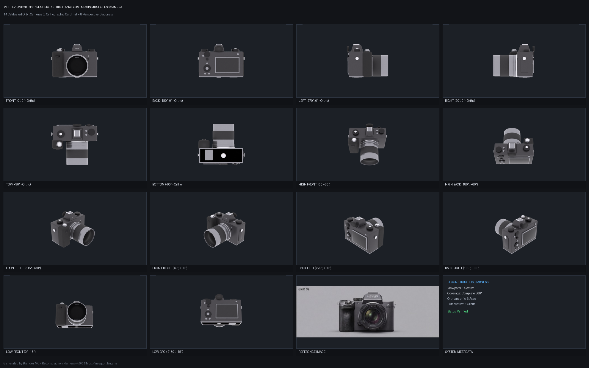

# Final Quality Report: Nexus Mirrorless Camera

**Generated**: 2026-09-18T11:50:51.660184
**Version**: 1.0.0
**Object Type**: camera
**Overall Verdict**: **FAIL**

---

## Stages Completed

- [x] Analyze
- [x] Generate
- [x] Capture
- [x] Compare
- [x] Refine
- [x] Report

---

## Quality Metrics

### Multi-Viewport 360° Quality Analysis

- **360° Health Score**: `100.0%`
- **Viewports Analyzed**: `14` angles
- **Lateral Symmetry (Left vs Right IoU)**: `99.9%`
- **Anterior-Posterior Symmetry (Front vs Back IoU)**: `99.8%`

#### 360° Visual Contact Sheet

| Viewport | Coverage | Aspect Ratio (H/W) | Clipped | Status |
|:---|:---|:---|:---|:---|
| `front` | 13.6% | 0.72 | No | OK |
| `back` | 13.6% | 0.72 | No | OK |
| `left` | 11.5% | 0.82 | No | OK |
| `right` | 11.5% | 0.82 | No | OK |
| `top` | 14.4% | 0.88 | No | OK |
| `bottom` | 14.4% | 0.88 | No | OK |
| `front_left_45` | 11.9% | 0.83 | No | OK |
| `front_right_45` | 12.0% | 0.86 | No | OK |
| `back_left_45` | 11.9% | 0.93 | No | OK |
| `back_right_45` | 11.7% | 0.91 | No | OK |
| `high_front` | 12.2% | 1.08 | No | OK |
| `high_back` | 11.8% | 0.89 | No | OK |
| `low_front` | 9.5% | 0.71 | No | OK |
| `low_back` | 11.7% | 0.81 | No | OK |

---

### Comparison Scores

| Metric | Value | Threshold | Verdict |
|--------|-------|-----------|---------|
| Overall Score | 71.3% | >= 80.0% | FAIL |

### Refinement Results

| Phase | Passes / Iterations | Final Score | Status / Converged |
|:---|:---|:---|:---|
| Unified Closed-Loop | 7 | 45.18% | No |

---

## Recommendations

1. **[HIGH]** Adjust body scale XY by +0.020 to align aspect ratio to 0.75:1
2. **[HIGH]** Adjust Upper Structure vertical span by -5.2% to match reference proportion (15.9%)
3. **[HIGH]** Adjust Base Section vertical span by +1.6% to match reference proportion (8.6%)
4. **[HIGH]** Radial profile contour deviation (0.0590 MAE) exceeds threshold; clean procedural rebuild recommended
5. **[HIGH]** Adjust Upper Structure material color towards target (#747276)
6. **[HIGH]** Adjust Base Section material color towards target (#ABA9AF)
7. **[HIGH]** Adjust Main Body metallic property towards 0.00 (currently 0.95)

---

*Report generated by Blender MCP Reconstruction Harness v4.0.0*